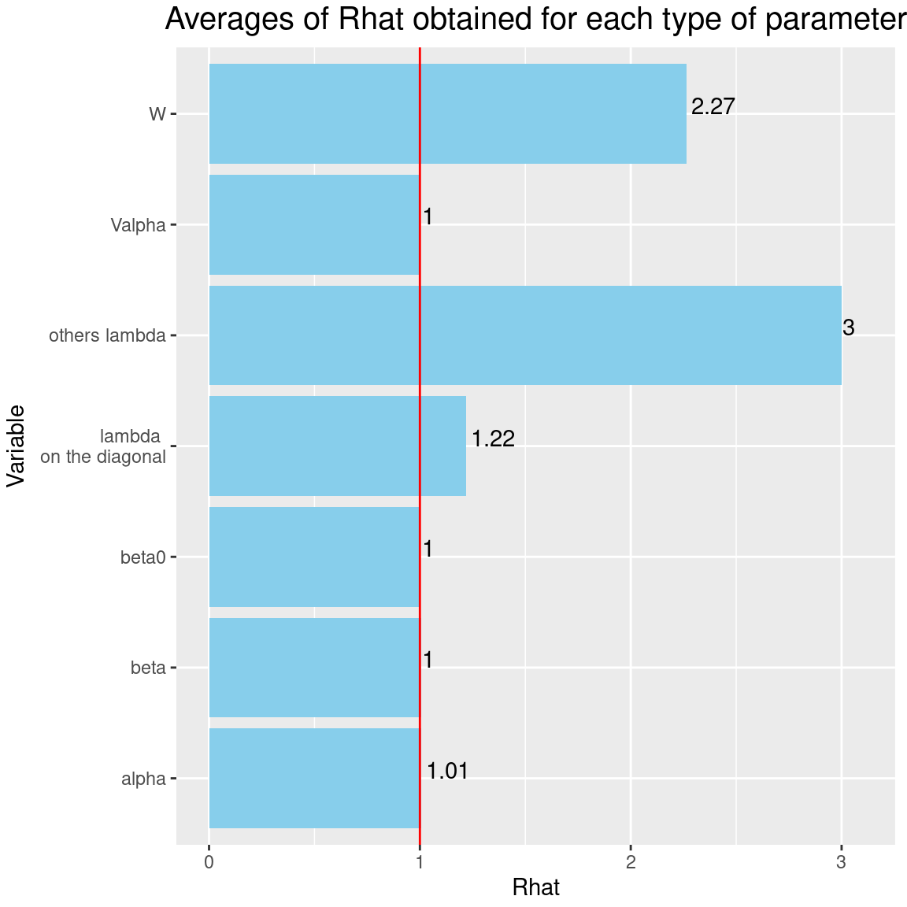
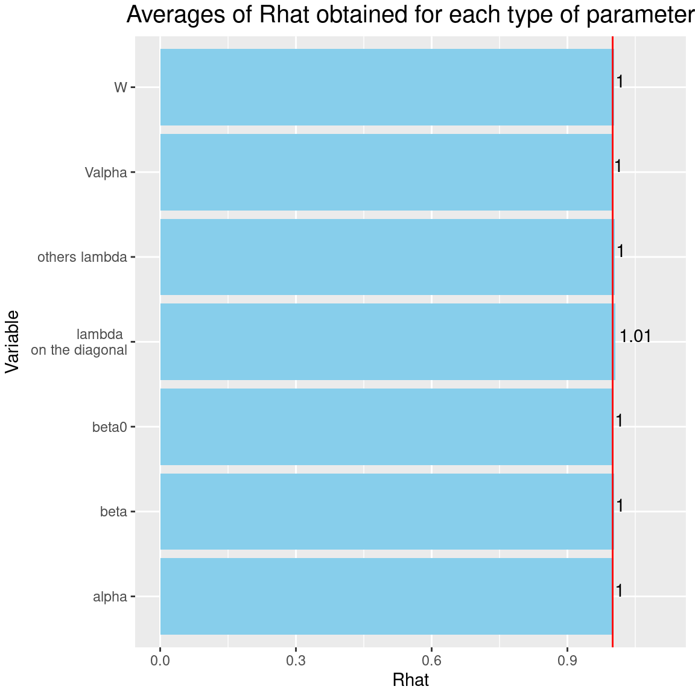

 
```{r setup, include=FALSE}
knitr::opts_chunk$set(
fig.align = "center",
fig.width = 6, fig.height = 6,
cache = TRUE,
collapse = TRUE,
comment = "#>",
highlight = TRUE,
eval = FALSE
)
```

# Load librairies 

```{r library, eval=TRUE}
# ===================================================
# Load libraries
# ===================================================
library(ggplot2)
library(coda)
library(parallel)
library(doParallel)
library(jSDM)
library(kableExtra)
```

# Model definition 

Referring to the models used in the articles @Warton2015 and @Albert1993, we define the following model :

$$ \mathrm{probit}(\theta_{ij}) =\alpha_i + X_i.\beta_j+ W_i.\lambda_j $$

Considering the latent variable $z$ such as $z_{ij} = \alpha_i + \beta_{0j} + X_i.\beta_j + W_i.\lambda_j + \epsilon_{i,j}$, with $\forall (i,j) \ \epsilon_{ij} \sim \mathcal{N}(0,1)$,  
it can be easily shown that: $y_{ij} \sim \mathcal{B}ernoulli(\theta_{ij})$, with: 

- Link function probit: $\mathrm{probit}: q \rightarrow \Phi^{-1}(q)$ where $\Phi$ correspond to the distribution function of the reduced centered normal distribution.

- $\theta_{ij}$: occurrence probability of the species $j$ on site $i$ for $j=1,\ldots,J$ and for $i=1,\ldots,I$.

- Response variable: $Y=(y_{ij})^{i=1,\ldots,nsite}_{j=1,\ldots,nsp}$ such as:

$$y_{ij}=\begin{cases}
0 & \text{ if species $j$ is absent on the site $i$}\\
1 &  \text{ if species  $j$ is present on the site $i$}.
\end{cases}$$

- $X_i$: Vector of explanatory variables for site $i$ with $X_i=(x_i^1,\ldots,x_i^p)\in \mathbb{R}^p$ where $p$ is the number of bio-climatic variables considered (including intercept $\forall i, x_i^1=1$).

- $\alpha_i$: Random effect of site $i$ such as $\alpha_i \sim \mathcal{N}(0, V_{\alpha})$, corresponds to a mean suitability for site $i$. We assumed that $V_{\alpha} \sim \mathcal{IG}(\text{shape}=0.1, \text{rate}=0.1)$.

- $\beta_j$: Effects of the explanatory variables on the probability of presence of species $j$ including species intercept ($\beta_{0j}$). We use a prior distribution $\beta_j \sim \mathcal{N}_p(0,1)$. 

- $W_i$: Vector of random latent variables for site $i$ such as $W_i \sim \mathcal{N}_q(0, 1)$ where the number of latent variables $q$ must be fixed by the user (default to $q=2$).

- $\lambda_j$: Effects of the latent variables on the probability of presence of species $j$ also known as "factor loadings" [@Warton2015]. We use the following prior distribution to constraint values to $0$ on upper diagonal and to strictly positive values on diagonal, for $j=1,\ldots,J$ and $l=1,\ldots,q$ : $$\lambda_{jl} \sim \begin{cases}
\mathcal{N}(0,1) & \text{if } l < j \\
\mathcal{N}(0,1) \text{ left truncated by } 0 & \text{if } l=j \\
P \text{ such as } \mathbb{P}(\lambda_{jl} = 0)=1  & \text{if } l>j
\end{cases}$$.  

This model is equivalent to a multivariate GLMM $\mathrm{g}(\theta_{ij}) = X_i.\beta_j + u_{ij}$, where $u_{ij} \sim \mathcal{N}(0, \Sigma)$ with the constraint that the variance-covariance matrix $\Sigma = \Lambda \Lambda^{\prime}$, where $\Lambda$ is the full matrix of factor loadings, with the $\lambda_j$ as its columns. 

After fitting the jSDM with latent variables, the **full species residual correlation matrix** $R=(R_{ij})^{i=1,\ldots, nspecies}_{j=1,\ldots, nspecies}$ can be derived from the covariance in the latent variables such as : 
$$\Sigma_{ij} = \lambda_i .\lambda_j^T$$, then we compute correlations from covariances :
$$R_{i,j} = \frac{\Sigma_{ij}}{\sqrt{\Sigma _{ii}\Sigma _{jj}}}$$.

# Data simulation

```{r data-simulation, eval=TRUE}
#==================
#== Data simulation
#==================
#= Number of species
nsp <- 50
#= Number of sites
nsite <- 150
#= Number of latent variables
n_latent <- 2
#= Set seed for repeatability
seed <- 12
set.seed(seed)

# Ecological process (suitability)
x1 <- rnorm(nsite,0,1)
x2 <- rnorm(nsite,0,1)
X <- cbind(rep(1,nsite),x1,x2)
colnames(X) <- c("Intercept","x1","x2")
np <- ncol(X)
#= Latent variables W
W <- matrix(rnorm(nsite*n_latent,0,1), nrow=nsite, ncol=n_latent)
#= Fixed species effect beta 
beta.target <- t(matrix(runif(nsp*np,-1,1), byrow=TRUE, nrow=nsp))
#= Factor loading lambda  
lambda.target <- matrix(0, n_latent,nsp)
mat <- t(matrix(runif(nsp*n_latent,-1,1), byrow=TRUE, nrow=nsp))
lambda.target[upper.tri(mat, diag=TRUE)] <- mat[upper.tri(mat, diag=TRUE)]
diag(lambda.target) <- runif(n_latent, 0, 1)
#= Variance of random site effect 
V_alpha.target <- 0.5
#= Random site effect alpha
alpha.target <- rnorm(nsite, 0, sqrt(V_alpha.target))

# Simulation of response data with probit link
probit_theta <- X %*% beta.target + W %*% lambda.target + alpha.target
theta <- pnorm(probit_theta)
e <- matrix(rnorm(nsp*nsite,0,1),nsite,nsp)
# Latent variable Z 
Z_true <- probit_theta + e
# Presence-absence matrix Y
Y <- matrix(NA, nsite,nsp)
for (i in 1:nsite){
  for (j in 1:nsp){
    if ( Z_true[i,j] > 0) {Y[i,j] <- 1}
    else {Y[i,j] <- 0}
  }
}
hist(probit_theta)
```

# Fitting JSDM with the species on first columns constrained

## Parameter inference

As a first step, we use the `jSDM_binomial_probit()` function to fit the JSDM in parallel, to obtain four MCMC chains of parameters, with the constrained species arbitrarily chosen as the first ones in the presence-absence data-set.

```{r jSDM-probit}
## Make a cluster for parallel MCMCs
nchains <- 4
ncores <- nchains ## One core for each MCMC chains
clust <- makeCluster(ncores)
registerDoParallel(clust)

# Seeds
seed_mcmc <- c(1, 12, 123, 1234)

# Model
mod <-
  foreach (i = 1:nchains) %dopar% {
    # Inferring model parameters
    mod <- jSDM::jSDM_binomial_probit(# Chains
                                      burnin=10000,
                                      mcmc=10000,
                                      thin=10,
                                      # Response variable 
                                      presence_data = Y, 
                                      # Explanatory variables 
                                      site_formula = ~.,   
                                      site_data = X[,-1],
                                      # Model specification 
                                      n_latent=2, 
                                      site_effect="random",
                                      # Starting values
                                      alpha_start=0,
                                      beta_start=0,
                                      lambda_start=0, 
                                      W_start=0,
                                      V_alpha=1, 
                                      # Priors
                                      shape=0.1, 
                                      rate=0.1,
                                      mu_beta=0, 
                                      V_beta=1,
                                      mu_lambda=0,
                                      V_lambda=1,
                                      # Other
                                      seed = seed_mcmc[i],
                                      verbose = 0
    )
    return(mod)
  }
# Stop cluster
stopCluster(clust)
```

## Evaluation of model convergence 

### The Gelman–Rubin convergence diagnostic

#### Definition 

The Gelman–Rubin diagnostic evaluates MCMC convergence by analyzing the difference between multiple Markov chains. The convergence is assessed by comparing the estimated between-chains and within-chain variances for each model parameter. Large differences between these variances indicate nonconvergence. See @Gelman1992 and @Brooks1998 for the detailed description of the method.

Suppose we have $M$ chains, each of length $N$, although the chains may be of different lengths. The same-length assumption simplifies the formulas and is used for convenience. For a model parameter $\theta$, let $\left(\theta_{mt}\right)_{t=1}^N$ be the $m$th simulated chain, $m=1,\dots,M$. Let $\hat{\theta}_m=\frac{1}{N}\sum\limits_{t=1}^N \hat{\theta}_{mt}$ and $\hat{\sigma}^2_m=\frac{1}{N-1}\sum\limits_{t=1}^N (\hat{\theta}_{mt}-\hat{\theta}_m)^2$ be the sample posterior mean and variance of the $m$th chain, and let the overall sample posterior mean be $\hat{\theta}=\frac{1}{M}\sum\limits_{m=1}^M \hat{\theta}_m$.

The between-chains and within-chain variances are given by
$$B=\frac{N}{M-1}\sum\limits_{m=1}^M (\hat{\theta}_m - \hat{\theta})^2$$
$$W=\frac{1}{M}\sum\limits_{m=1}^M\hat{\sigma}^2_m$$

 Under certain stationarity conditions, the pooled variance : 
 
 $$\hat{V}=\frac{N-1}{N}W + \frac{M+1}{MN}B$$
 
is an unbiased estimator of the marginal posterior variance of $\theta$ (@Gelman1992). The potential scale reduction factor (PSRF) is defined to be the ratio of $\hat{V}$ and $W$. If the $M$ chains have converged to the target posterior distribution, then PSRF should be close to 1. The article @Brooks1998 corrected the original PSRF by accounting for sampling variability as follows:
$$ \hat{R}= \sqrt{\frac{\hat{d}+3}{\hat{d}+1}\frac{\hat{V}}{W}}$$

where $\hat{d}$  is the degrees of freedom estimate of a $t$ distribution.

PSRF estimates the potential decrease in the between-chains variability $B$ with respect to the within-chain variability $W$. If $\hat{R}$ is large, then longer simulation sequences are expected to either decrease $B$ or increase $W$ because the simulations have not yet explored the full posterior distribution. As the article @Brooks1998 have suggested, if $\hat{R} < 1.2$ for all model parameters, one can be fairly confident that convergence has been reached. Otherwise, longer chains or other means for improving the convergence may be needed. Even more reassuring is to apply the more stringent condition $\hat{R} < 1.1$.

#### Compute $\hat{R}$  

We evaluate the convergence of the MCMC output in which four parallel chains are run.
Convergence is diagnosed when the four chains have ‘forgotten’ their initial values, and the output from all chains is indistinguishable.
If the convergence diagnostic gives values of potential scale reduction factor (PSRF) or $\hat{R}$
substantially above 1, its indicates lack of convergence.

```{r Rhat}
# Number of latent variables 
n_latent <- mod[[1]]$model_spec$n_latent
# Results from list to mcmc.list format
burnin <- mod[[1]]$model_spec$burnin
ngibbs <- burnin + mod[[1]]$model_spec$mcmc
thin <-  mod[[1]]$model_spec$thin
require(coda)
arr2mcmc <- function(x) {
  return(mcmc(as.data.frame(x),
              start=burnin+1 , end=ngibbs, thin=thin))
}
mcmc_list_alpha <- mcmc.list(lapply(lapply(mod,"[[","mcmc.alpha"), arr2mcmc))
mcmc_list_V_alpha <- mcmc.list(lapply(lapply(mod,"[[","mcmc.V_alpha"), arr2mcmc))
mcmc_list_V_alpha <- mcmc.list(lapply(lapply(mod,"[[","mcmc.V_alpha"), arr2mcmc))
mcmc_list_param <- mcmc.list(lapply(lapply(mod,"[[","mcmc.sp"), arr2mcmc))
mcmc_list_lv <- mcmc.list(lapply(lapply(mod,"[[","mcmc.latent"), arr2mcmc))
mcmc_list_beta <- mcmc_list_param[,grep("beta",colnames(mcmc_list_param[[1]]))]
mcmc_list_beta0 <- mcmc_list_beta[,grep("Intercept", colnames(mcmc_list_beta[[1]]))]
mcmc_list_lambda <- mcmc.list(
  lapply(mcmc_list_param[, grep("lambda", 
                                     colnames(mcmc_list_param[[1]]),
                                     value=TRUE)], arr2mcmc))
mcmc_list_Deviance <-  mcmc.list(lapply(lapply(mod,"[[","mcmc.Deviance"), arr2mcmc))
# Rhat
psrf_alpha <- mean(gelman.diag(mcmc_list_alpha, multivariate=FALSE)$psrf[,2])
psrf_V_alpha <- gelman.diag(mcmc_list_V_alpha)$psrf[,2]
psrf_beta0 <- mean(gelman.diag(mcmc_list_beta0)$psrf[,2])
psrf_beta <- mean(gelman.diag(mcmc_list_beta[,grep("Intercept", colnames(mcmc_list_beta[[1]]), invert=TRUE)])$psrf[,2])
psrf_lambda_diag <- mean(gelman.diag(mcmc_list_lambda[,c(1, n_latent+2)],
                                     multivariate=FALSE)$psrf[,2])
# mean(psrf, na.rm=TRUE) because zeros on upper triangular Lambda matrix give NaN in psrf
psrf_lambda_others <- mean(gelman.diag(mcmc_list_lambda[,-c(1, n_latent+2)],
                                       multivariate=FALSE)$psrf[,2],
                           na.rm=TRUE)
psrf_lv <- mean(gelman.diag(mcmc_list_lv, multivariate=FALSE)$psrf[,2])
Rhat <- data.frame(Rhat=c(psrf_alpha, psrf_V_alpha, psrf_beta0, psrf_beta,
                          psrf_lambda_diag, psrf_lambda_others, psrf_lv),
                   Variable=c("alpha", "Valpha", "beta0", "beta",
                              "lambda \n on the diagonal", "others lambda", "W"))
# Barplot
library(ggplot2)
ggplot(Rhat, aes(x=Variable, y=Rhat)) + 
  ggtitle("Averages of Rhat obtained for each type of parameter") +
  theme(plot.title = element_text(hjust = 0.5, size=15)) +
  theme(plot.margin = margin(t = 0.1, r = 0.2, b = 0.1, l = 0.1,"cm")) +
  geom_bar(fill="skyblue", stat = "identity") +
  geom_text(aes(label=round(Rhat,2)), vjust=0, hjust=-0.1) +
  ylim(0, max(Rhat$Rhat)+0.1) +
  geom_hline(yintercept=1, color='red') +
  coord_flip() 
```

```{r Rhat-plot, echo=FALSE, out.width=800, eval=TRUE}

```

It can be seen that the $\hat{R}$s associated with the factor loadings $\lambda$ and latent variables $W$, are well above 1, which indicates a lack of convergence for these parameters, even after $20000$ iterations including $10000$ of burn-in. 

### Representation of parameter trace and density *a posteriori*

We visually evaluate the convergence of MCMCs by representing the trace and density *a posteriori* of some estimated parameters, with their expected values represented by a red vertical line.

```{r plot-results-probit}
np <- nrow(mod[[1]]$model_spec$beta_start)
nchains <- length(mod)
## beta_j of the first two species 
par(mfrow=c(2,2))
names <- varnames(mcmc_list_beta[,1:(2*np)])
for(j in 1:2){
  for(p in 1:np){
    coda::traceplot(mcmc_list_beta[,p + (j-1)*np],
                    main =paste0("Trace of ", names[p + (j-1)*np]))
    coda::densplot(mcmc_list_beta[,p + (j-1)*np],
                   main=paste0("Density of ", names[p + (j-1)*np]))
    abline(v=beta.target[p,j], col='red')
  }
}
## lambda_j of the first two species 
n_latent <- mod[[1]]$model_spec$n_latent
names <- varnames(mcmc_list_lambda[,1:(2*n_latent)])
par(mfrow=c(2,2))
for(j in 1:2){
  for(l in 1:n_latent){
  coda::traceplot(mcmc_list_lambda[,l + (j-1)*n_latent],
                  main =paste0("Trace of ", names[l + (j-1)*n_latent]))
  coda::densplot(mcmc_list_lambda[,l + (j-1)*n_latent],
                 main=paste0("Density of ", names[l + (j-1)*n_latent]))
  abline(v=lambda.target[l,j], col='red')
  }
}
## Latent variables W_i for the first two sites
par(mfrow=c(2,2))
nsite <- ncol(mod[[1]]$mcmc.alpha)
names <- varnames(mcmc_list_lv)
for(l in 1:n_latent){
 for(i in 1:2){
coda::traceplot(mcmc_list_lv[, i + (l-1)*nsite],
                main=paste0("Trace of ", names[i + (l-1)*nsite]))
coda::densplot(mcmc_list_lv[, i + (l-1)*nsite],
                main=paste0("Density of ", names[i + (l-1)*nsite]))
abline(v=W[i,l], col='red')
 }
}

## alpha_i of the first two sites
names <- varnames(mcmc_list_alpha)
for(i in 1:2){
coda::traceplot(mcmc_list_alpha[,i],
                main=paste0("Trace of ", names[i]))
coda::densplot(mcmc_list_alpha[,i],
               main=paste0("Density of ", names[i]))

abline(v=alpha.target[i], col='red')
}

## V_alpha
par(mfrow=c(2,2))
coda::traceplot(mcmc_list_V_alpha)
coda::densplot(mcmc_list_V_alpha)
abline(v=V_alpha.target, col='red')
## Deviance
plot(mcmc_list_Deviance,
     auto.layout=FALSE)
```

```{r plot-results-probit2, echo=FALSE, out.width=800, eval=TRUE}
knitr::include_graphics(paste0("jSDM_binomial_probit_sp_constrained_files/figure-html/plot-results-probit-", 1:9, ".png"))
```

Overall, the traces and the densities of the parameters indicate the convergence of the algorithm. Indeed, we observe on the traces that the values oscillate around averages without showing an upward or downward trend and we see that the densities are quite smooth and for the most part of Gaussian form, except for the factor loadings $\lambda$ and latent variables $W$.  
In fact the values estimated for $\lambda$ and $W$ differ between the four chains and within each chain, the traces of these parameters oscillate very strongly showing upward or downward trends and we see that the densities are not of Gaussian form, as expected.  

This lack of convergence can be explained by the arbitrary choice of the species constrained to have positive values of $\lambda$ as being the first ones in the presence-absence data set. Indeed, the constrained species are supposed to be the ones that structure most clearly each latent axis but by arbitrarily choosing them this is not necessarily the case.


## Evaluation of model accuracy

We plot the estimated parameters according to the expected ones to assess the accuracy of the package `jSDM` results.

```{r obs-fitted, eval=TRUE, out.width=800}
## Predictive posterior mean for each observation
nchains <- length(mod)
# Factor loadings lambda
param_jSDM <- list()
mean_param <- matrix(0, nsp, np+n_latent)
for (i in 1:nchains){
  param_jSDM[[i]] <- matrix(unlist(lapply(mod[[i]]$mcmc.sp,colMeans)), nrow=nsp, byrow=T)
  mean_param <- mean_param + param_jSDM[[i]]/nchains
}
par(mfrow=c(1,2))
for(l in 1:n_latent){
  for (i in 1:nchains){
    if (i==1){
      plot(t(lambda.target)[,l],
           param_jSDM[[i]][,np+l],
           main=paste0("factor loadings lambda_", l),
           xlab ="obs", ylab ="fitted")
      abline(a=0,b=1, col='red')
    } else {
      points(t(lambda.target)[,l],
             param_jSDM[[i]][,np+l],
             col=i)
    }
  }
}

## W latent variables
mean_W_jSDM <- list()
W_jSDM <- matrix(0, nsite, n_latent)
for (i in 1:nchains){
    mean_W_jSDM[[i]] <- sapply(mod[[i]]$mcmc.latent,colMeans)
    W_jSDM <- W_jSDM +  mean_W_jSDM[[i]]/nchains
}
for (l in 1:n_latent) {
  for (i in 1:nchains){
    if (i==1){
      plot(W[,l], mean_W_jSDM[[i]][,l],
           main = paste0("Latent variable W_", l),
           xlab ="obs", ylab ="fitted")
      abline(a=0,b=1, col='red')
    }
    else{
      points(W[,l], mean_W_jSDM[[i]][,l], col=i)
    }
  }
}

#= W.lambda
for (i in 1:nchains){
  if (i==1){
    plot(W%*%lambda.target, 
         mean_W_jSDM[[i]]%*%t(param_jSDM[[i]][,(np+1):(np+n_latent)]),
         main = "W.lambda",
         xlab ="obs", ylab ="fitted")
    abline(a=0,b=1, col='red')
  }
  else{
    points(W%*%lambda.target, 
           mean_W_jSDM[[i]]%*%t(param_jSDM[[i]][,(np+1):(np+n_latent)]), col=i)
  }
}

# Species effects beta 
for (i in 1:nchains){
  if(i==1){
    plot(t(beta.target), param_jSDM[[i]][,1:np],
         main="species effect beta",
         xlab ="obs", ylab ="fitted")
    abline(a=0,b=1, col='red')
  }
  else{
    points(t(beta.target), param_jSDM[[i]][,1:np], col=i)
  }
}
# Site effect alpha et V_alpha
plot(alpha.target,colMeans(mod[[1]]$mcmc.alpha),
     xlab="obs", ylab="fitted",
     main="Random site effect alpha")
abline(a=0,b=1, col='red')
points(V_alpha.target, mean(mod[[1]]$mcmc.V_alpha),
       pch=18, cex=2)
legend("bottomright", legend=c("V_alpha"), pch =18, pt.cex=1.5)
for (i in 2:nchains){
points(alpha.target, colMeans(mod[[i]]$mcmc.alpha), col=i)
points(V_alpha.target, mean(mod[[i]]$mcmc.V_alpha),
       pch=18, col=i, cex=2)
}

#= Predictions 
## theta
mean_theta <- matrix(0,nsite,nsp)
for (i in 1:nchains){
  mean_theta <- mean_theta + mod[[i]]$theta_latent/nchains
  if(i==1){
    plot(pnorm(probit_theta),
     mod[[i]]$theta_latent,
     main="theta",
     xlab="obs",
     ylab="fitted",
     ylim=c(0,1))
  } else{
  points(pnorm(probit_theta),
         mod[[i]]$theta_latent,
         col=i)
  }
}
RMSE <- sqrt(sum((pnorm(probit_theta)-mean_theta)^2)/(nsp*nsp))
abline(a=0,b=1, col='red')
legend("topleft",pch=1, bty="n", cex=0.9,
       c(paste("RMSE: ",round(RMSE,3))))
abline(a=0,b=1, col='red')
## probit(theta)
plot(probit_theta, mod[[1]]$probit_theta_latent,
     main="probit(theta)",
     xlab="obs",ylab="fitted")
for (i in 2:nchains){
  points(probit_theta, mod[[i]]$probit_theta_latent, col=i)
}
abline(a=0,b=1, col='red')
# Residual covariance Matrix
Sigma.target <- t(lambda.target) %*% lambda.target 
Sigma <- list()
mean_Sigma <- matrix(0, nsp, nsp)
for(i in 1:nchains){
  Sigma[[i]] <- jSDM::get_residual_cor(mod[[i]])$cov.mean
  mean_Sigma <- mean_Sigma + Sigma[[i]]/nchains
  if(i==1){
    plot(Sigma.target, Sigma[[i]], col=i,
         main=expression(paste("Residual covariance matrix ",Sigma)),
         xlab="obs", ylab="fitted")
  } else{
    points(Sigma.target, Sigma[[i]], col=i)
  }
}
RMSE_Sigma <- sqrt(sum((Sigma.target-mean_Sigma)^2)/(nsp*nsp))
legend("topleft",pch=1, bty="n", cex=0.9,
       c(paste("RMSE: ",round(RMSE_Sigma,3))))
abline(a=0,b=1, col='red')

## Mean over all chains
for(l in 1:n_latent){
plot(t(lambda.target[l,]), mean_param[,np+l],
     main = paste0("Factor loadings lambda_",l, " averaged over MCMCs"),
     cex.main=0.7,
     xlab ="obs", ylab ="fitted",
     ylim=c(min(lambda.target[l,]), max(lambda.target[l,])))
abline(a=0,b=1, col='red')
plot(W[,l], W_jSDM[,l],
     main = paste0("Latent variable W_",l, " averaged over MCMCs"),
     cex.main=0.7,
     xlab ="obs", ylab ="fitted",
     ylim=c(min(W[,l]), max(W[,l])))
abline(a=0,b=1, col='red')
}
plot(W%*%lambda.target, 
     W_jSDM%*%t(mean_param[,(np+1):(np+n_latent)]),
     main = "W.lambda",
     xlab ="obs", ylab ="fitted",
     ylim=c(min(W%*%lambda.target), max(W%*%lambda.target)))
abline(a=0,b=1, col='red')
plot(Sigma.target,
     mean_param[,(np+1):(np+n_latent)] %*% t(mean_param[,(np+1):(np+n_latent)]), 
     main=expression(paste("Residual covariance matrix ",Sigma)),
     xlab="obs", ylab="fitted")
abline(a=0,b=1, col='red')
```

```{r obs-fitted2, echo=FALSE, out.width=800,  eval=TRUE}
knitr::include_graphics(paste0("jSDM_binomial_probit_sp_constrained_files/figure-html/obs-fitted-", 1:8, ".png"))
```

We observe that the values estimated for species effects $\beta$, random site effects $\alpha$ and their variance correspond pretty well to the values expected.  
However, it can be seen that the estimated values of factor loadings $\lambda$ and latent variables $W$ differ from the values expected. Indeed, it can be seen that the values of $W$ and $\lambda$ estimated for the second latent axis correspond to the inverse of the simulated values, except for the chain represented in green. This sign inversion for the second latent axis between estimated and expected values can be explained by the identifiability issue within the multiplication $W.\lambda$. This can be a problem if we consider the average over all chains, to estimate the values of $\lambda$ and $W$, as it can be seen on the last graphics.

Nevertheless the overall estimated values, within each chain, for the term $W.\lambda$, the residual covariance matrix $\Sigma$ and the occurrence probabilities $\theta$ are close from the expected values. 

# Fitting JSDM with the chosen constrained species 

## Parameter inference

As a second step we use the `jSDM_binomial_probit_sp_constrained()` function to fit the JSDM in parallel, to obtain four MCMC chains of parameters.  
At first, the function fit a JSDM with the constrained species arbitrarily chosen as the first ones in the presence-absence data-set.  
Then, the function evaluates the convergence of MCMC $\lambda$ chains using the Gelman-Rubin convergence diagnostic ($\hat{R}$). It identifies the species ($\hat{j}_l$) having the higher $\hat{R}$ for $\lambda_{\hat{j}_l}$. These species drive the structure of the latent axis $l$. The $\lambda$ corresponding to this species are constrained to be positive and placed on the diagonal of the $\Lambda$ matrix for fitting a second model.  
This usually improves the convergence of the latent variables and factor loadings. The function returns the parameter posterior distributions for this second model.

```{r jSDM-probit-ord}
# Model
# Inferring model parameters
mod_ord <- jSDM::jSDM_binomial_probit_sp_constrained(# Chains
                                                     ncores=4,
                                                     nchains=4,
                                                     # Iteration
                                                     burnin=10000,
                                                     mcmc=10000,
                                                     thin=10,
                                                     # Response variable 
                                                     presence_data = Y, 
                                                     # Explanatory variables 
                                                     site_formula = ~.,   
                                                     site_data = X[,-1],
                                                     # Model specification 
                                                     n_latent=2, 
                                                     site_effect="random",
                                                     # Starting values
                                                     alpha_start=0,
                                                     beta_start=0,
                                                     lambda_start=0, 
                                                     W_start=0,
                                                     V_alpha=1, 
                                                     # Priors
                                                     shape=0.1, 
                                                     rate=0.1,
                                                     mu_beta=0, 
                                                     V_beta=1,
                                                     mu_lambda=0,
                                                     V_lambda=1,
                                                     # Other
                                                     seed = seed_mcmc[i],
                                                     verbose = 0
)
```

## Evaluation of model convergence 

### The Gelman–Rubin convergence diagnostic

We evaluate the convergence of the MCMC output in which four parallel chains are run.
Convergence is diagnosed when the four chains have ‘forgotten’ their initial values, and the output from all chains is indistinguishable.
If the convergence diagnostic gives values of potential scale reduction factor (PSRF) or $\hat{R}$
substantially above 1, its indicates lack of convergence.

```{r Rhat-ord}
# Results from list to mcmc.list format
burnin <- mod_ord[[1]]$model_spec$burnin
ngibbs <- burnin + mod_ord[[1]]$model_spec$mcmc
thin <-  mod_ord[[1]]$model_spec$thin
require(coda)
arr2mcmc <- function(x) {
  return(mcmc(as.data.frame(x),
              start=burnin+1 , end=ngibbs, thin=thin))
}
mcmc_list_alpha <- mcmc.list(lapply(lapply(mod_ord,"[[","mcmc.alpha"), arr2mcmc))
mcmc_list_V_alpha <- mcmc.list(lapply(lapply(mod_ord,"[[","mcmc.V_alpha"), arr2mcmc))
mcmc_list_param <- mcmc.list(lapply(lapply(mod_ord,"[[","mcmc.sp"), arr2mcmc))
mcmc_list_lv <- mcmc.list(lapply(lapply(mod_ord,"[[","mcmc.latent"), arr2mcmc))
mcmc_list_beta <- mcmc_list_param[,grep("beta",colnames(mcmc_list_param[[1]]))]
mcmc_list_beta0 <- mcmc_list_beta[,grep("Intercept", colnames(mcmc_list_beta[[1]]))]
mcmc_list_lambda <- mcmc.list(
  lapply(mcmc_list_param[, grep("lambda", 
                                     colnames(mcmc_list_param[[1]]),
                                     value=TRUE)], arr2mcmc))
# Rhat
psrf_alpha <- mean(gelman.diag(mcmc_list_alpha, multivariate=FALSE)$psrf[,2])
psrf_V_alpha <- gelman.diag(mcmc_list_V_alpha)$psrf[,2]
psrf_beta0 <- mean(gelman.diag(mcmc_list_beta0)$psrf[,2])
psrf_beta <- mean(gelman.diag(mcmc_list_beta[,grep("Intercept",
                                                   colnames(mcmc_list_beta[[1]]),
                                                   invert=TRUE)])$psrf[,2])
id_sp_constrained <- NULL
for(l in 1:n_latent){
id_sp_constrained <- c(id_sp_constrained,
                       grep(mod_ord[[1]]$sp_constrained[l], 
                            varnames(mcmc_list_lambda)))
}
psrf_lambda_diag <- mean(gelman.diag(
  mcmc_list_lambda[,id_sp_constrained],
  multivariate=FALSE)$psrf[,2],
  na.rm=TRUE)
# mean(psrf, na.rm=TRUE) because zeros on upper triangular Lambda matrix give NaN in psrf
psrf_lambda_others <- mean(gelman.diag(mcmc_list_lambda[,-id_sp_constrained],
                                       multivariate=FALSE)$psrf[,2])
psrf_lv <- mean(gelman.diag(mcmc_list_lv,
                            multivariate=FALSE)$psrf[,2])
Rhat <- data.frame(Rhat=c(psrf_alpha, psrf_V_alpha, psrf_beta0, psrf_beta,
                          psrf_lambda_diag, psrf_lambda_others, psrf_lv),
                   Variable=c("alpha", "Valpha", "beta0", "beta",
                              "lambda \n on the diagonal", "others lambda", "W"))
# Barplot
library(ggplot2)
ggplot2::ggplot(Rhat, aes(x=Variable, y=Rhat)) + 
  ggtitle("Averages of Rhat obtained for each type of parameter") +
  theme(plot.title = element_text(hjust = 0.5, size=15)) + 
  theme(plot.margin = margin(t = 0.1, r = 0.2, b = 0.1, l = 0.1,"cm")) +
  geom_bar(fill="skyblue", stat = "identity") +
  geom_text(aes(label=round(Rhat,2)), vjust=0, hjust=-0.1) +
  ylim(0, max(Rhat$Rhat)+0.1) +
  geom_hline(yintercept=1, color='red') +
  coord_flip() 
```

```{r Rhat-ord-plot, echo=FALSE, out.width=800, eval=TRUE}

```

It can be seen that the $\hat{R}$s associated with the factor loadings $\lambda$ and latent variables $W$ are much closer to 1 than previously, after the same number of iterations and with the same random number generator seeds. Consequently the convergence of factor loadings has improved by selecting the constrained species.

### Representation of parameter trace and density *a posteriori*

We visually evaluate the convergence of MCMCs by representing the trace and density *a posteriori* of some estimated parameters. 

```{r plot-results-probit-ord}
np <- nrow(mod_ord[[1]]$model_spec$beta_start)
n_latent <- mod_ord[[1]]$model_spec$n_latent
nchains <- length(mod_ord)

## beta_j of the first two species and the species constrained 
par(mfrow=c(2,2))
names <- varnames(mcmc_list_beta)
sp_constrained <- as.numeric(gsub("sp_", "", mod_ord[[1]]$sp_constrained))
for(j in c(1:2, sp_constrained)){
  for(p in 1:np){
    coda::traceplot(mcmc_list_beta[,p + (j-1)*np],
                    main =paste0("Trace of ", names[p + (j-1)*np]))
    coda::densplot(mcmc_list_beta[,p + (j-1)*np],
                   main=paste0("Density of ", names[p + (j-1)*np]))
    abline(v=beta.target[p,j], col='red')
  }
}
## lambda_j of the first two species and the species constrained 
n_latent <- mod_ord[[1]]$model_spec$n_latent
names <- varnames(mcmc_list_lambda)
par(mfrow=c(2,2))
for(j in c(1:2, sp_constrained)){
  for(l in 1:n_latent){
    coda::traceplot(mcmc_list_lambda[,l + (j-1)*n_latent],
                    main =paste0("Trace of ", names[l + (j-1)*n_latent]))
    coda::densplot(mcmc_list_lambda[,l + (j-1)*n_latent],
                   main=paste0("Density of ", names[l + (j-1)*n_latent]))
    abline(v=lambda.target[l,j], col='red')
    #abline(v=lambda.target[ifelse(l==1,2,1),j], col='blue')
  }
}
## Latent variables W_i for the first two sites
par(mfrow=c(2,2))
nsite <- ncol(mod_ord[[1]]$mcmc.alpha)
names <- varnames(mcmc_list_lv)
for(l in 1:n_latent){
  for(i in 1:2){
    coda::traceplot(mcmc_list_lv[, i + (l-1)*nsite],
                    main=paste0("Trace of ", names[i + (l-1)*nsite]))
    coda::densplot(mcmc_list_lv[, i + (l-1)*nsite],
                   main=paste0("Density of ", names[i + (l-1)*nsite]))
    abline(v=W[i,l], col='red')
    #abline(v=W[i,ifelse(l==1,2,1)], col='blue')
  }
}

## alpha_i of the first two sites
names <- varnames(mcmc_list_alpha)
for(i in 1:2){
  coda::traceplot(mcmc_list_alpha[,i],
                  main=paste0("Trace of ", names[i]))
  coda::densplot(mcmc_list_alpha[,i],
                 main=paste0("Density of ", names[i]))
  
  abline(v=alpha.target[i], col='red')
}

## V_alpha
par(mfrow=c(2,2))
coda::traceplot(mcmc_list_V_alpha)
coda::densplot(mcmc_list_V_alpha)
abline(v=V_alpha.target, col='red')
## Deviance
plot(mcmc_list_Deviance,
     auto.layout=FALSE)
```

```{r plot-results-probit-ord2, echo=FALSE, out.width=800, eval=TRUE}
knitr::include_graphics(paste0("jSDM_binomial_probit_sp_constrained_files/figure-html/plot-results-probit-ord-", 1:15, ".png"))
```

Overall, the traces and the densities of the parameters indicate the convergence of the algorithm. Indeed, we observe on the traces that the values oscillate around averages without showing an upward or downward trend and we see that the densities are quite smooth and for the most part of Gaussian form, even for the factor loadings $\lambda$, of species $31$ and $19$, constrained to be positive on the diagonal.  

## Evaluation of model accuracy

We plot the estimated parameters according to the expected ones to assess the accuracy of the package `jSDM` results.

```{r obs-fitted-ord, eval=TRUE, out.width=800}
## Predictive posterior mean for each observation
nchains <- length(mod_ord)
# Factor loadings lambda
param_jSDM <- list()
mean_param <- matrix(0, nsp, np+n_latent)
for (i in 1:nchains){
  param_jSDM[[i]] <- matrix(unlist(lapply(mod_ord[[i]]$mcmc.sp,colMeans)), nrow=nsp, byrow=T)
  mean_param <- mean_param + param_jSDM[[i]]/nchains
}
par(mfrow=c(1,2))
for(l in 1:n_latent){
  for (i in 1:nchains){
    if (i==1){
      plot(t(lambda.target)[,l],
           param_jSDM[[i]][,np+l],
           main=paste0("factor loadings lambda_", l),
           xlab ="obs", ylab ="fitted")
      abline(a=0,b=1, col='red')
    } else {
      points(t(lambda.target)[,l],
             param_jSDM[[i]][,np+l],
             col=i)
    }
  }
}

for(l in 1:n_latent){
  for (i in 1:nchains){
    if (i==1){
      plot(t(lambda.target)[,ifelse(l==1,2,1)],
           param_jSDM[[i]][,np+l],
           main="factor loadings lambda",
           xlab=paste0("obs lambda_", ifelse(l==1,2,1)),
           ylab=paste0("fitted lambda_", l))
      abline(a=0,b=1, col='red')
    } else {
      points(t(lambda.target)[,ifelse(l==1,2,1)],
             param_jSDM[[i]][,np+l], 
             col=i)
    }
  }
}
## W latent variables
mean_W_jSDM <- list()
W_jSDM <- matrix(0, nsite, n_latent)
for (i in 1:nchains){
    mean_W_jSDM[[i]] <- sapply(mod_ord[[i]]$mcmc.latent,colMeans)
    W_jSDM <- W_jSDM +  mean_W_jSDM[[i]]/nchains
}
for (l in 1:n_latent) {
  for (i in 1:nchains){
    if (i==1){
      plot(W[,l], mean_W_jSDM[[i]][,l],
           main = paste0("Latent variable W_", l),
           xlab ="obs", ylab ="fitted")
      abline(a=0,b=1, col='red')
    }
    else{
      points(W[,l], mean_W_jSDM[[i]][,l], col=i)
    }
  }
}

for (l in 1:n_latent) {
  for (i in 1:nchains){
    if (i==1){
      plot(W[,ifelse(l==1,2,1)], mean_W_jSDM[[i]][,l],
           main="Latent variable W",
           xlab=paste0("obs W_", ifelse(l==1,2,1)),
           ylab=paste0("fitted W_", l))
      abline(a=0,b=1, col='red')
    }
    else{
      points(W[,ifelse(l==1,2,1)], mean_W_jSDM[[i]][,l], col=i)
    }
  }
}
#= W.lambda
for (i in 1:nchains){
  if (i==1){
    plot(W%*%lambda.target, 
         mean_W_jSDM[[i]]%*%t(param_jSDM[[i]][,(np+1):(np+n_latent)]),
         main = "W.lambda",
         xlab ="obs", ylab ="fitted")
    abline(a=0,b=1, col='red')
  }
  else{
    points(W%*%lambda.target, 
           mean_W_jSDM[[i]]%*%t(param_jSDM[[i]][,(np+1):(np+n_latent)]), col=i)
  }
}

# Species effects beta 
for (i in 1:nchains){
  if(i==1){
    plot(t(beta.target), param_jSDM[[i]][,1:np],
         main="species effect beta",
         xlab ="obs", ylab ="fitted")
    abline(a=0,b=1, col='red')
  }
  else{
    points(t(beta.target), param_jSDM[[i]][,1:np], col=i)
  }
}
# Site effect alpha et V_alpha
plot(alpha.target,colMeans(mod_ord[[1]]$mcmc.alpha),
     xlab="obs", ylab="fitted",
     main="Random site effect alpha")
abline(a=0,b=1, col='red')
points(V_alpha.target, mean(mod_ord[[1]]$mcmc.V_alpha),
       pch=18, cex=2)
legend("bottomright", legend=c("V_alpha"), pch =18, pt.cex=1.5)
for (i in 2:nchains){
points(alpha.target, colMeans(mod_ord[[i]]$mcmc.alpha), col=i)
points(V_alpha.target, mean(mod_ord[[i]]$mcmc.V_alpha),
       pch=18, col=i, cex=2)
}

#= Predictions 
## theta
mean_theta <- matrix(0,nsite,nsp)
for (i in 1:nchains){
  mean_theta <- mean_theta + mod[[i]]$theta_latent/nchains
  if(i==1){
    plot(pnorm(probit_theta),
     mod_ord[[i]]$theta_latent,
     main="theta",
     xlab="obs",
     ylab="fitted",
     ylim=c(0,1))
  } else{
  points(pnorm(probit_theta),
         mod_ord[[i]]$theta_latent,
         col=i)
  }
}
abline(a=0,b=1, col='red')
RMSE <- sqrt(sum((pnorm(probit_theta)-mean_theta)^2)/(nsp*nsp))
legend("topleft", pch=1, bty="n", cex=0.9,
       c(paste("RMSE: ",round(RMSE,3))))
abline(a=0,b=1, col='red')
## probit(theta)
plot(probit_theta, mod_ord[[1]]$probit_theta_latent,
     main="probit(theta)",
     xlab="obs",ylab="fitted")
for (i in 2:nchains){
  points(probit_theta,
         mod_ord[[i]]$probit_theta_latent,
         col=i)
}
abline(a=0,b=1, col='red')
# Residual covariance Matrix
Sigma.target <- t(lambda.target) %*% lambda.target 
Sigma <- list()
mean_Sigma <- matrix(0, nsp, nsp)
for(i in 1:nchains){
  Sigma[[i]] <- jSDM::get_residual_cor(mod_ord[[i]])$cov.mean
  mean_Sigma <- mean_Sigma + Sigma[[i]]/nchains
  if(i==1){
    plot(Sigma.target, Sigma[[i]], col=i,
         main=expression(paste("Residual covariance matrix ",Sigma)),
         xlab="obs", ylab="fitted")
  } else{
    points(Sigma.target, Sigma[[i]], col=i)
  }
}
RMSE_Sigma <- sqrt(sum((Sigma.target-mean_Sigma)^2)/(nsp*nsp))
legend("topleft",pch=1, bty="n", cex=0.9,
       c(paste("RMSE: ", round(RMSE_Sigma, 3))))
abline(a=0,b=1, col='red')

## Mean over all chains
for(l in 1:n_latent){
  plot(t(lambda.target)[,ifelse(l==1,2,1)],
       mean_param[,np+l],
       main="Lambda factor loadings averaged over MCMCs",
       cex.main=0.7,
       xlab=paste0("obs lambda_", ifelse(l==1,2,1)),
       ylab=paste0("fitted lambda_", l))
  abline(a=0,b=1, col='red')
plot(W[,ifelse(l==1,2,1)], W_jSDM[,l],
     main="Latent variable W averaged over MCMCs",
     cex.main=0.7,
     xlab=paste0("obs W_", ifelse(l==1,2,1)),
     ylab=paste0("fitted W_", l))
abline(a=0,b=1, col='red')
}
plot(W%*%lambda.target, 
     W_jSDM%*%t(mean_param[,(np+1):(np+n_latent)]),
         main = "W.lambda",
         xlab ="obs", ylab ="fitted")
    abline(a=0,b=1, col='red')
plot(Sigma.target, 
     mean_param[,(np+1):(np+n_latent)] %*% t(mean_param[,(np+1):(np+n_latent)]), 
     main=expression(paste("Residual covariance matrix ",Sigma)),
     xlab="obs", ylab="fitted")
     abline(a=0,b=1, col='red')
```

```{r obs-fitted-ord2, echo=FALSE, out.width=800,  eval=TRUE}
knitr::include_graphics(paste0("jSDM_binomial_probit_sp_constrained_files/figure-html/obs-fitted-ord-", 1:10, ".png"))
```

We observe that the values estimated for species effects $\beta$, random site effects $\alpha$ and their variance correspond pretty well to the values expected. 

Moreover, it can be seen that the values of $W$ and $\lambda$ estimated for the first latent axis in the four chains, correspond well with the the second latent axis simulated. This inversion of the latent axes between estimated and expected values can be explained by the identifiability issue within the multiplication $W.\lambda$. In this case, there is no problem if we consider the average over all chains, to estimate the values of $\lambda$ and $W$, as it can be seen on the last graphics.
In addition, the overall estimated values, within each chain, for the term $W.\lambda$, the residual covariance matrix $\Sigma$ and the occurrence probabilities $\theta$ are close from the expected values. 

# References