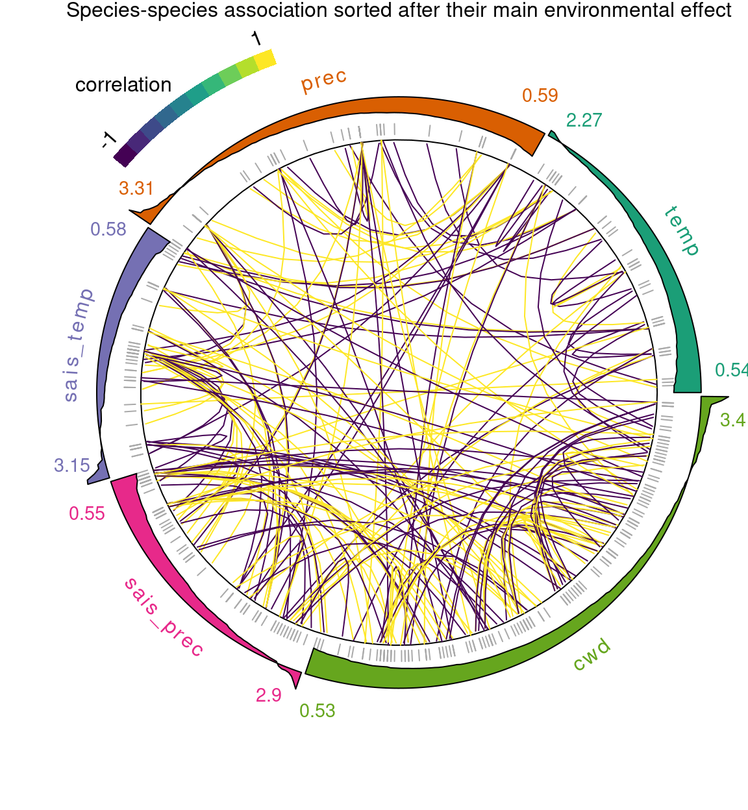

# Abstract

<!-- 350 words max -->
<!-- 1. Set context and purpose of the work -->
<!-- 2. Indicate approach and methods -->
<!-- 3. Outline main results -->
<!-- 4. Identify conclusion and wider implication -->

<!-- This approach is particularly interesting for rare species which can borrow information from other more abundant species. Moreover, theses models-->

1. Species distribution models (SDMs) are commonly used in ecology to predict the ecological niche of species. However SDMs do not take into account interactions between species to estimate species distributions. Joint Species Distribution Models (JSDMs), which have recently emerged in ecology, allow to take into account co-occurrences between species to predict their distribution [@Warton2015]. Moreover these models provide a conceptual framework for integrating functional traits to explain differences in occurrence between species [@Warton2015; @Ovaskainen2017]. Several libraries have been developed to fit such models following different statistical approaches (R packages `Hmsc` [@Ovaskainen2017], `boral` [@Hui2016] ...). However, these libraries may have some limitations. Not all of them allow the handling of large data-sets, the management of missing data and of data with multiple visits by site or the monitoring of latent variables convergence in JSDMs. 

2. Here, we present the recently developed `jSDM` R package (<https://ecology.ghislainv.fr/jSDM>) for fitting JSDMs, to overcome the limitations of current libraries. Parameter inference is done in a hierarchical Bayesian framework and uses optimized C++ code to allow the analysis of large data-sets, with a high number of parameters in a limited amount of time. 

3. We compared the calculation time, accuracy, and predictive performance of the `Hmsc`, `boral`, and `jSDM` libraries for fitting JSDMs on six real data-sets [@Wilkinson2019; @Choler2005; @Borcard1994] and one simulated. We also used the package `jSDM` for fitting a JSDM including species traits to analyze the response of alpine plants [@Choler2005] to snowmelt date, according to their specific leaf area (SLA). Furthermore, we developed a method to improve latent variables convergence, by selecting species with constrained factor loadings. Moreover, we used this package to fit a JSDM for tree species in Madagascar, combining tree occurrences from a large forest inventory and climate data. We used our model to derive distribution maps both at the species and community level (species richness and $\beta$-diversity maps). 

4. We expect reduced computational time using `jSDM` rather than `Hmsc` or `boral` for fitting JSDMs with equivalent or better accuracy and predictive performance. JSDMs can be used to understand better the environmental filtering based on species functional traits. Also, community maps can be used for systematic conservation planning identifying priority areas for conservation based on species richness or uniqueness.

# Introduction

## State of the art

One of the key challenges in ecology is to understand the structure and assembly dynamics of ecological communities, shaped by both abiotic and biotic filtering [@Vellend2010]. Indeed, the abundances and distributions of species depend not only on their individual responses to the abiotic environment, but also on their interactions [@Wisz2013]. During the last two decades, species distribution models (SDMs) [@Elith2009]) have been commonly used in ecology to predict the ecological niches of species, independently of each other. However, SDMs do not take into account interactions between species and very often only consider environmental filtering, to predict the occurrence of species (abundance or probability of presence). Moreover, these correlative models do not allow to explain the differences in occurrence between species, via their functional traits for example. In addition, stacked SDMs (SSDMs) [@Schmitt2017] are widely used to perform community-level predictions (e.g., community composition or species richness). This method combines multiple individual SDMs to produce a community-level model. It thus assumes that species respond individualistically to variation in environmental conditions [@Guisan2011], whereas interacting communities of species are more than the sum of their component species.  
Methodological advances in multiple-species distribution modelling have recently experienced a rapid expansion, with the emergence of joint species distribution models (JSDMs) [@Golding2015; @Hui2016; @Ovaskainen2017; @Clark2017; @Niku2019; @Pichler2021], which allow to take into account interactions between species to predict their occurrence. Moreover these models provide a conceptual framework for integrating phylogeny relationships and functional traits to explain differences in occurrence between species [@Warton2015; @Ovaskainen2017], assuming, for example, that closely related species with like traits have more similar environmental niches, than expected by random. These models can thus be expected to have better predictive performance than SSDMs in terms of community composition or species richness, because biotic interactions represent an important driver of species local coexistence [@Wisz2013]. Indeed recent literature, as the article @Norberg2019, supports this hypothesis. Even if it might be assumed that considering each species separately is more consistent with our limited current understanding of community assembly, because it can be difficult to predict *a priori* the joint structure of entire species assemblages responses to environmental variations [@Norberg2019]. Actually, treating each species individually, via SDMs, may involve a higher risk of overfitting, while borrowing information from other species, using JSDMs, may improve predictive performance, if the species respond similarly enough to abiotic variation [@Ovaskainen2011; @Hui2013]. Indeed, recent literature on species distribution modelling shows that the JSDM approach, by assuming shared responses to the environment, can improve predictive performance especially for rare species, which can borrow information from other more common species [@Ovaskainen2011; @Hui2013; @Tikhonov2017; @Norberg2019]. In fact, common species may present more reliable statistical relationships with environmental variables than rare species with large and dispersed distributions [@Segurado2004], so considering species assemblages as a whole may actually improve the relevance of estimated environmental relationships for rarer species within communities [@Ovaskainen2011; @Hui2013]. Thus, the use of JSDMs can be expected to be generally beneficial in community ecology studies, since most ecological communities consist of a few common and many rare species. Consequently, over the last few years, many libraries have been developed to fit JSDMs following different statistical approaches. Some of them, as well as their main features, are presented in the Table \@ref(tab:Methods-and-softwares-for-fitting-JSDMs). 

(ref:table-ref1) @Ovaskainen2017

(ref:table-ref2) @Hui2016 

(ref:table-ref3) @Pichler2021

(ref:table-ref4) @Clark2017

(ref:table-ref5) @Golding2015

(ref:table-ref6) @Niku2019

(ref:table-ref7) @pymc3

(ref:table-ref8) @Golding2019

(ref:table-ref9) @Plummer2003

(ref:table-ref10) @Stan2021

```{r load librairies, include=FALSE, echo=FALSE}
library(knitr)
library(kableExtra)
library(here)
```

```{r Methods-and-softwares-for-fitting-JSDMs, echo=FALSE}
tab <- read.csv(here("jSDM_functionalities", "softwares_comparison_table.csv"), stringsAsFactors = FALSE, header=TRUE, check.names = FALSE, sep=";")
url <- c("http://CRAN.R-project.org/package=jSDM",
         "http://CRAN.R-project.org/package=Hmsc",
         "http://CRAN.R-project.org/package=boral",
         "http://CRAN.R-project.org/package=sjSDM",
         "http://CRAN.R-project.org/package=gjam",
         "http://CRAN.R-project.org/package=BayesComm",
         "http://CRAN.R-project.org/package=gllvm",
         "https://docs.pymc.io/en/v3/",
         "https://greta-stats.org/",
         "https://mcmc-jags.sourceforge.io/",
         "https://mc-stan.org/")
names <- c("jSDM", "Hmsc", "boral", "sjSDM", "gjam", "BayesComm", "gllvm", "PyMC3", "greta", "JAGS", "Stan")
href <- paste0("\\href{", url, "}{", names, "}")
tab[37, 2:9] <- c(href[1:7], paste(href[8:11], collapse=", "))
tab[36, 3:9] <- c("(ref:table-ref1)", "(ref:table-ref2)",
                  "(ref:table-ref3)", "(ref:table-ref4)",
                  "(ref:table-ref5)", "(ref:table-ref6)",
                  paste(c("(ref:table-ref7)", "(ref:table-ref8)",
                        "(ref:table-ref9)", "(ref:table-ref10)"),
                        collapse=", "))
knitr::kable(tab, format = 'latex', escape=FALSE,
             caption="Non-exhaustive list of softwares packages
             designed for fitting JSDMs with their main features. 
             In the following table MC means Monte Carlo,
             Neg.Bin is for negative binomial distribution,
             LVM means latent variable model and LV latent variable.",
             booktabs=TRUE, align = 'l') %>%
    row_spec(0, bold=TRUE) %>%
    column_spec(1, bold=TRUE, width="2.9cm") %>%
    column_spec(2:8, width = "1.4cm") %>%
    column_spec(9, width = "2cm") %>%
    group_rows("Speed", 4, 6, underline = TRUE) %>%
    group_rows("Data type", 8, 11, underline = TRUE) %>%
    group_rows("Distribution (link)", 12, 18, underline = TRUE) %>%
    group_rows("Site effect", 19, 21, underline = TRUE) %>%
    group_rows("Species effect", 22, 23, underline = TRUE) %>%
    group_rows("Factor loadings", 27, 29, underline = TRUE) %>%
    group_rows("Number of LV", 30, 31, underline = TRUE) %>%
    group_rows("User friendly", 32, 33, underline = TRUE) %>%
    group_rows("Additional functions", 34, 35, underline = TRUE) %>%
		kableExtra::kable_styling(latex_options=c("HOLD_position",
		                                          "striped","scale_down",
		                                          "condensed", "hover"), 
		                          font_size = 6.5,
		                          full_width=FALSE) 
```

## Knowledge gap

However, these libraries may have some limitations. Indeed, only one of them [@Clark2017], allows the fitting of JSDM from presence only data, only if a model for sampling effort is specified, while occurrence data that do not record species absences, such as herbarium data or the huge \href{https://www.gbif.org/fr/}{GBIF} database, gather thousands of data-sets concerning very numerous species. Furthermore, only two of these libraries (`jSDM` and `gjam`) are able to consider data-sets with missing data, e.g. inventories in which some species were not inventoried on certain sites. Probabilistic programming libraries (`PyMC3`, `greta`, `JAGS`, and `Stan`), allow a wide variety of JSDMs to be specified and fitted from different data types and formats, but it can be challenging for ecologists to develop Bayesian hierarchical models with constraints, latent variables and mixed effects or including spatial variation and species traits. Excluding these libraries, the only R packages capable of fitting JSDMs from long format data are `jSDM` and `gllvm`. In addition, the `jSDM` and `boral` packages are the only ones that can consider presence-absence data with multiple visits at sites, i.e., non-binary responses, following a binomial distribution with more than one trial, however `jSDM` allows specifying a number of trials for each site and `boral` can only consider different number of trials for each species.

  * LVM   
  *  monitoring of latent variables convergence and factor loadings in JSDMs. 
  * spatially explicit models 
  * taking into account species traits as explanatory variables of the model

Not all of them allow the handling of large data-sets, 

  * Speed and data-set size (Hmsc, boral), computation time on large data-sets.
  * Heterogeneous model performance (Hmsc, boral, gjam [@Norberg2019]). @Wilkinson2019, for a comparative study of fitting JSDMs, using `boral`, `Hmsc`, `BayesComm` and `gjam` (see Table \@ref(tab:Methods-and-softwares-for-fitting-JSDMs)),

## Response

- Objectives of the implementation of `jSDM` R package with optimized C++ code (Armadillo and GSL librairies) : 
  * Open source, new functionalities easy to implement, evolving package 
  * Fill some of this gaps.
  * New functionalities : fourth corner model, long format
  * Relatively fast inference (lower compilation time) The code is optimized and allows the estimation of parameters for large data-sets in a limited amount of time. 
  
  * Easy to use functions --> model comparison and in depth study of the advantages of JSDMs.
- Application on Madagascar forest inventories, current climate conditions
- Application on alpine plants data set including species traits 
- Selection of species with constrained factor loadings to improve convergence of latent variables models 

# Major functionalities of the `jSDM ` R package

## The structure of the JSDM problem

### Data used 

The data needed to fit JSDMs are the realizations of a response variable, $Y=(y_{ij})^{i=1,\ldots,I}_{j=1,\ldots,J}$ corresponding to the presence-absence or abundance data of the species, as well as the explanatory variables $X=(X_i)_{i=1,\ldots,I}$, with $X_i=(x_{i0},x_{i1},\ldots,x_{ip})\in \mathbb{R}^{p+1}$, where $p$ is the number of bioclimatic or environmental variables considered for each site and $\forall i, x_{i0}=1$. Species traits can also be included in the model as $T=(T_j)_{j=1,\ldots,J}$ with $T_j=(t_{j0},t_{j1},\ldots,t_{jn})\in \mathbb{R}^n$ where $n$ is the number of species traits considered and $\forall j, t_{j0}=1$.

These data can be provided in a wide format as above, or in a long format that allows to handle missing data, in the package `jSDM`.  

- Response variable: $Y=(y_{n})^{n=1,\ldots,nobs}$ such as $species_n=j$ and $site_n=i$ with:

- Explanatory variables: bioclimatic data about each site. $X=(X_i)_{i=1,\ldots,n}$ with $X_i=(1,x_i^1,\ldots,x_i^p)\in \mathbb{R}^{(p+1)}$ where $p$ is the number of bioclimatic variables considered. explanatory variables found in matrix $D=(D_n)_{i=1,\ldots,nobs}$.


\begin{figure}[H]
\centering
\includegraphics[width=0.4\textwidth]{figures/dataset}
\label{fig:dataset}
\caption{$Y$: occurrences of species recorded in a set of spatial sampling units, $X$: environmental covariates measured over the sampling units and $T$: traits measured for the species in the $Y$ matrix.}
\end{figure}

### Model definition 

We took inspiration from the articles @Warton2015 and @Ovaskainen2017 to develop the hierarchical approaches used to specify the joint species distribution model in the `jSDM` package.

We could use a multivariate generalized linear model **(GLMM)** of the form: 
$$g(\theta_{ij}) = \alpha_i + X_i\beta_j + u_{ij},$$
$$y_{ij} \sim \mathcal{B}inomial(n_i,\theta_{ij}), \text{for presence/absence data}$$
$$ \text{or } y_{ij} \sim \mathcal{P}oisson(\theta_{ij}), \text{for abundance data}$$

$$u_i \sim \mathcal{N}_J(0_{\mathbb{R}^J},\Sigma) \ iid,$$

where

- $n_i$ is the number of visits at site $i$, and $\theta_{ij}$ is the probability of presence of species $j$ at site $i$ for presence/absence data or the average abundance of species $j$ at site $i$.

- $g : [0,1[ \rightarrow [ -\infty, +\infty[$ is a link function (probit, logit or log). The inference method is able to handle only one visit by site with a probit link function so $\forall i, \ n_i=1$ and $y_{ij} \sim \mathcal{B}ernoulli(\theta_{ij})$ in this case.

- $\alpha_i$ represents the random or fixed effect of site $i$. In the case of it is random $\alpha_i \sim \mathcal{N}(0, V_{\alpha})$ *iid* and independent from $u_i$, we also assume that $V_{\alpha} \sim \mathcal{IG}(\text{shape}, \text{rate})$ as prior distribution.

- $\beta_j=(\beta_{j0}, \beta_{j1},\ldots,\beta_{jp})'$ are the intercept and regression coefficients corresponding to the bioclimatic or environmental variables for species $j$ assumed to be fixed effects.
  - In the absence of trait-specific data, the species effects: $\beta_j$; follow the same *a priori* Gaussian distribution for each species $j$ such as: 
 $\beta_j \sim \mathcal{N}_{p+1}(\mu_{\beta},\Sigma_{\beta})$. 
  - If trait-specific data are provided, we consider a fourth corner model to estimate traits-environment interactions, with the effect of species $j$: $\beta_j$; following a Gaussian distribution *a priori* such as : 
$\beta_j\sim \mathcal{N}_{p+1}(\mu_{\beta_j},\Sigma_{\beta})$, where $\mu_{\beta_{jk}} = \sum_{r=0}^{n} t_{jr}.\gamma_{rk}$ for $k=0,\ldots,p$, takes different values for each species. In this case we assume that  $\gamma_{rk} \sim \mathcal{N}(\mu_{\gamma_{rk}},V_{\gamma_{rk}})$ as an *a priori* distribution.

- $u_i=(u_{i1},\ldots,u_{iJ})$ is a correlated multivariate random effect whose variance-covariance matrix $\Sigma$ controls the correlation between species and is assumed to be completely unstructured. This last part of the model is problematic when the number of species $J$ is large, because the number of parameters in $\Sigma$ increases quadratically with $J$.

However, in the package `jSDM`, we consider the following latent variable model **(LVM)** : 
$$g(\theta_{ij}) = \alpha_i + X_i\beta_j + W_i\lambda_j$$

This LVM is equivalent to a particular case of GLMM with the constraint $\Sigma = \Lambda \Lambda'$ where $\Lambda := (\lambda_{jl})_{j=1,\ldots,J}^{l=1,\ldots,q}$, by assuming $u_{ij} = W_i\lambda_j$, with $W_i=(W_{i1},\ldots,W_{iq})$ the $q$ latent variables (or "unmeasured predictors") considered, such as $W_i \sim \mathcal{N}(0,I_q)$ *iid* and independent from $\alpha_i$, and $\lambda_j=(\lambda_{j1},\ldots, \lambda_{jq})'$ the corresponding factor loadings.   
Moreover, to ensure the identifiability of the model, the $\Lambda$ matrix is constrained to be lower triangular and to take strictly positive values on the diagonal, according to the article @Warton2015. In fact, we use the following prior distribution, for $j=1,\ldots,J$ and $l=1,\ldots,q$ : 
$$\lambda_{jl} \sim \begin{cases}
\mathcal{N}(\mu_\lambda,V_\lambda) & \text{if } l < j \\
\mathcal{N}(\mu_\lambda,V_\lambda) \text{ left truncated by } 0 & \text{if } l=j \\
\mathbb{P}(\lambda_{jl} = 0)=1  & \text{if } l>j
\end{cases}$$.

We have chosen to consider this type of model, because it facilitates the estimation of the residual correlation matrix between species : $$R_{ij} = \frac{\Sigma_{ij}}{\sqrt{\Sigma _{ii}\Sigma _{jj}}}.$$
Indeed, a LVM includes potentially much less parameters to estimate than the corresponding GLMM, because $\Lambda$ counts as many columns as there are latent variables in the model ($q$) while $\Sigma$ contains as much columns as considered species ($J$). 

In following applications we will fix $q=2$. Indeed, we will consider models with two latent variables, like in the article @Warton2015, by analogy with a principal component analysis (PCA) on the residuals, for which we often use the first two or three axes, because the integration of latent variables to the models is similar to a form of ordination. 

Default values of hyper parameters, for each  *a priori* distribution, are specified in the package, and can be easily modified by the user. 

\begin{figure}[H]
\caption{A graphical summary of the Bayesian hierarchical model considered by \texttt{jSDM}. In this directed acyclic graph (DAG), the orange boxes refer to the data, the blue circles to the parameters to be estimated, and the arrows to the functional relationships described using statistical distributions}
\centering
\includegraphics[height=0.4\textheight]{figures/DAG-jSDM-rand.png}
\end{figure}


$$ \mathrm{probit}(\theta_{n}) =\alpha_i + D_n.\gamma + X_n.\beta_j +  W_i.\lambda_j,$$
such as $species_n=j$ and $site_n=i$.

- Latent variable $z_{n} = \alpha_i + D_n.\gamma + X_n.\beta_j + W_i.\lambda_j + \epsilon_{n}$, with $\forall (n) \ \epsilon_{n} \sim \mathcal{N}(0,1)$ and such that:

$$y_{n}=\begin{cases}
1 & \text{if} \ z_{n} > 0 \\
0 &  \text{otherwise.}
\end{cases}$$

It can be easily shown that: $y_{n} \sim \mathcal{B}ernoulli(\theta_{n})$. 

- $\gamma$ correspond to the regression coefficients of explanatory variables found in matrix $D=(D_n)_{i=1,\ldots,nobs}$. We use a prior distribution $\mathcal{N}(0,10)$ for all parameters $\gamma$. 

## Bayesian inference methods

The Bayesian inference methods used by the package to estimate the parameters of the JSDMs are summarized in this section. For more information, you will find a detailed presentation with demonstrations in the vignette \href{https://ecology.ghislainv.fr/jSDM/articles/proof.html}{Bayesian inference methods}. 

Fitting of hierarchical Bayesian models defined above is performed by a Gibbs sampler written in C++ to maximize computation efficiency. It uses [Rcpp](https://cran.r-project.org/package=Rcpp) to call routines in C++ within R functions, C/C++ libraries ([GSL](https://www.gnu.org/software/gsl/)) for random draws and ([Armadillo](http://arma.sourceforge.net/docs.html)) for matrix calculations. However, the implementation of a Gibbs sampler requires the knowledge of the *a posteriori* distributions of each of the parameters, conditionally to the other parameters of the model.

### Gibbs sampler with conjugate priors for probit link function 

According to the article @Albert1993, a possible formulation for models with probit link function, is to assume the existence of an underlying latent variable linked to our observed binary variable such as $z_{ij} = \alpha_i + X_i\beta_j+ W_i\lambda_j + \epsilon_{ij}$ $\forall i,j$ with $\epsilon_{ij} \sim \mathcal{N}(0,1)$  *iid*  and :
$$y_{ij}=
\begin{cases}
1 & \text{ if } z_{ij} > 0 \\
0 &  \text{else.}
\end{cases}$$
In this case, parameter's conditional *a posteriori* distributions can be deduced from the conjugate priors formulas. 

### Adaptive Metropolis-within-Gibbs algorithm for logit or log link functions

In the same way as for the probit model, we can define the models with logit or log link function, using an underlying latent variable, but in this case the *a priori* distributions of the latent variable and the parameters are not conjugated. The properties of conjugate priors cannot therefore be used to deduce an explicit expression for parameter's conditional *a posteriori* distributions. Consequently, the parameters of these models will be sampled according to an estimation of their conditional distributions *a posteriori*, using an adaptive Metropolis algorithm.

## Additionnal outputs  

- Deviance 
- Diagnostic functions (covariance, correlation, significance and plot 
functions)

# Applications


## Fitting JSDM including species traits 

Analyzing response of alpine plants [@Choler2005] to snowmelt Date according to their SLA 

# Fitting JSDM from long format dataset with missing data 

## Inference of biodiversity maps in Madagascar from large forest inventories

### Datasets 

#### Forest inventory

National forest inventories carried out on $753$ sites on the island of Madagascar are available, listing the presence or absence of $555$ plant species on each of these sites between 1994 and 1996.
We use these forest inventories to calculate a matrix indicating the presence by a $1$ and the absence by a $0$ of the species at each site by removing observations for which the species is not identified. This matrix therefore records the occurrences of $483$ ($n_{sp}$) species at $751$ ($n_{site}$) sites.

#### Current environmental variables

Among the climatic and environmental data available on the site \url{https://madaclim.cirad.fr}, concerning the whole island of Madagascar at present (interpolations of representative observed data from the years 1960-1990), and with a resolution of 1km, we chose to use the following variables, because they have an ecological meaning which makes them easily interpretable and are little correlated between them, according to the article @Vieilledent2013 : 

```{r clim-variables, echo=FALSE}
results <- data.frame(variable=c("temp","prec","sais.temp","sais.prec","cwd"), description=c("the average annual temperature ($^\\circ C\\times 10$)", "the average annual precipitation (mm).", "the seasonality of temperatures corresponds to the standard deviation of monthly temperatures multiplied by 100.", "the seasonality of precipitation as a coefficient of variation.", "the annual climatic water deficit (mm) is based on monthly precipitation ($prec$) and potential evapotranspiration ($pet$) which is defined as the amount of evaporation that would occur in a month if a sufficient water source were available: $\\mathrm{cwd}=\\sum_{m=1}^{12}\\min(0,\\mathrm{prec}_m-\\mathrm{pet}_m)$.")) 

knitr::kable(results, "latex", row.names=F, booktabs=TRUE, align = 'l', escape=FALSE, caption="Climatic variables") %>%
  column_spec(1, bold=TRUE) %>%
  column_spec(2, width="8cm") %>%
  kableExtra::kable_styling(latex_options=c("HOLD_position","striped"), full_width=FALSE)
```

We consider also the quadratic effects of these climate variables to perform a quadratic regression, which is more suitable for fitting a niche model than a linear regression. The values of these climate variables, on the coordinates of the inventory plots, are extracted, scaled and centered. The resulting data-set is used as explanatory variables for fitting the JSDM. 

### Fitting joint species distribution model (JSDM) 

#### Model definition

We use the latent variable model (LVM) defined previously to account for species co-occurrence on all sites :

$$ \mathrm{probit}(\theta_{ij}) =\alpha_i + \beta_{0j}+X_i.\beta_j+ W_i.\lambda_j $$

It can be easily shown that the response variable $y_{ij} \sim \mathcal{B}ernoulli(\theta_{ij})$ by defining the latent variable :  
$z_{ij} = \alpha_i + \beta_{0j} + X_i.\beta_j + W_i.\lambda_j + \epsilon_{i,j}$, with $\forall (i,j) \ \epsilon_{ij} \sim \mathcal{N}(0,1)$, such that:

$$y_{ij}=\begin{cases}
1 & \text{if} \ z_{ij} > 0 \\
0 &  \text{otherwise.}
\end{cases}$$

- Latent variables: $W_i=(W_i^1,\ldots,W_i^q)$ where $q$ is the number of latent variables considered, which has to be fixed by the user (in this case $q=2$).
We assume that $W_i \sim \mathcal{N}(0,I_q)$ and we define the associated coefficients  $\lambda_j=(\lambda_j^1,\ldots, \lambda_j^q)'$, also known as "factor loadings" [@Warton2015]. We use a prior distribution $\mathcal{N}(0,1)$ for all lambda not concerned by constraints to $0$ on upper diagonal and to strictly positive values on diagonal. 

- Explanatory variables: bioclimatic data about each site and their quadratic effects. $X=(X_i)_{i=1,\ldots,n_{site}}$ with $X_i=(\mathrm{temp}_i, \mathrm{prec}_i, \mathrm{sais.temp}_i, \mathrm{sais.prec}_i, \mathrm{cwd}_i, \mathrm{temp}_i^2, \mathrm{prec}_i^2, \mathrm{sais.temp}_i^2, \mathrm{sais.prec}_i^2, \mathrm{cwd}_i^2)\in \mathbb{R}^p$ where $p=10$ is the number of variables considered.
The corresponding regression coefficients for each species $j$ are noted : $\beta_j=(\beta_j^1,\ldots,\beta_j^p)'$. We use a prior distribution $\mathcal{N}(0,1)$ for all beta.  

- $\beta_{0j}$ corresponds to the intercept for species $j$ which is assumed to be a fixed effect. We use a prior distribution $\mathcal{N}(0,10)$ and define the prevalence of species $j$ ($p_j=\sum\limits_{i=1}^{n_{site}}\frac{y_{ij}}{n_{site}}$) as starting values for the species intercept to improve the estimation of this parameter.

- $\alpha_i$ represents the random effect of site $i$ such as $\alpha_i \sim \mathcal{N}(0,V_{\alpha})$ and we assume that $V_{\alpha} \sim \mathcal {IG}(\text{shape}=0.1, \text{rate}=0.1)$ as prior distribution by default. 

#### Parameters inference

We fit a binomial joint species distribution model, including two latent variables and a random site effect using the `jSDM_binomial_probit()` function to perform binomial probit regression considering all the species from the data described above, by performing $80 000$ iterations including $40 000$ of burn-in and we retain $N_{samp}=1 000$ values for each parameter of the model.

```{r fit-JSDM-Mada-table, echo=FALSE, include=TRUE}
load("~/Documents/projet_BioSceneMada/Report/Internship_Report/data/mada_mod.RData")
nsp<-ncol(mod_all$model_spec$presence_data)
nplot<-nrow(mod_all$model_spec$presence_data)
p <- nrow(mod_all$model_spec$beta_start)
n_latent <- mod_all$model_spec$n_latent
T_all <- as.numeric(T_all,units="hours")
results <- data.frame(nsp,nplot,n_obs=nsp*nplot, 
                      n_param=(p+n_latent)*nsp-1 + nplot*(n_latent+1) + 1,
                      ngibbs="80000","Time"= T_all, dev=mean(mod_all$mcmc.Deviance))
colnames(results)<- c("Number of species", "Number of sites", "Number of observations","Number of estimated parameters", "Iterations performed","Computation time (hours)","Deviance")
knitr::kable(results, "latex", row.names=F, digits=1, booktabs=TRUE, align = 'c',
             caption="Compuation time for fitting JSDM from Madagascar data-sets and deviance obtained") %>%
    column_spec(1:9, width="1.9cm") %>%
		kableExtra::kable_styling(latex_options=c("HOLD_position","striped"), full_width=FALSE)
```

<!-- ```{r fit-JSDM-Mada-table, echo=FALSE, include=TRUE} -->
<!-- load("~/Documents/projet_BioSceneMada/Report/data/mada_mod.RData") -->
<!-- nsp <- ncol(mod_all$model_spec$presence_data) -->
<!-- nplot <- nrow(mod_all$model_spec$presence_data) -->
<!-- p <- nrow(mod_all$model_spec$beta_start) -->
<!-- n_latent <- mod_all$model_spec$n_latent -->
<!-- T_all <- as.numeric(T_all,units="mins") -->
<!-- # Accuracy  -->
<!-- # Compute the proportion of species predicted as present  -->
<!-- # among the species  observed at each site for the different data-sets. -->
<!-- Sensitivity <- function(PA, theta){ -->
<!--   n_sites <- nrow(PA) -->
<!--   score <- 0 -->
<!--   for(i in 1:n_sites){ -->
<!--     # Sensitivity  -->
<!--     obs_sp <- which(PA[i,]>0) -->
<!--     nobs_sp <- length(obs_sp) -->
<!--     pred_sp <- which(theta[i,] >= sort(theta[i,], decreasing = TRUE)[nobs_sp]) -->
<!--     score <- score + sum(pred_sp %in% obs_sp)/ifelse(nobs_sp!=0, nobs_sp,1) -->
<!--   } -->
<!--   return(score/n_sites) -->
<!-- } -->
<!-- sensitivity <- Sensitivity(mod_all$model_spec$presence_data, mod_all$theta_latent) -->
<!-- Specificity  <- function(PA, theta){ -->
<!--   n_sites <- nrow(PA) -->
<!--   score <- 0 -->
<!--   for(i in 1:n_sites){ -->
<!--     # Specificity  -->
<!--     abs_sp <- which(PA[i,]==0) -->
<!--     nabs_sp <- length(abs_sp) -->
<!--     pred_abs_sp <- which(theta[i,] <= sort(theta[i,])[nabs_sp]) -->
<!--     score <- score + sum(pred_abs_sp %in% abs_sp)/ifelse(nabs_sp!=0, nabs_sp, 1) -->
<!--   } -->
<!--   return(score/n_sites) -->
<!-- } -->
<!-- specificity <- Specificity(mod_all$model_spec$presence_data, mod_all$theta_latent) -->
<!-- results <- data.frame(nsp,nplot,n_obs=nsp*nplot, n.col.X=p, n.latent=n_latent, -->
<!--                       n_param=(p+n_latent)*nsp-1 + nplot*(n_latent+1) + 1, -->
<!--                       ngibbs="80000", dev=round(mean(mod_all$mcmc.Deviance)), TSS=sensitivity+specificity-1, "Time"= round(T_all)) -->
<!-- colnames(results)<- c("n.species", "n.sites", "n.obs", "n.col.X", "n.latent", "n.param", "n.mcmc", "Deviance", "TSS", "Computation time (min)") -->
<!-- knitr::kable(results, "latex", row.names=F, digits=1, booktabs=TRUE, align = 'c') %>% -->
<!--     row_spec(0, bold=TRUE) %>% -->
<!--     column_spec(10, width="2cm") %>% -->
<!-- 		kableExtra::kable_styling(latex_options=c("HOLD_position","striped","scale_down"), full_width=FALSE) %>% -->
<!--     kableExtra::save_kable(file="figures/JSDM_Mada_poster.pdf", density=600) -->
<!-- ``` -->

#### Evaluation of MCMC convergence 

multiple chains Rhat  ?

### Predictive performance of the model  

compute AUC, Rprecision on inventory sites to assess the predictive performance of the model ?

### Estimated species-species associations

After fitting the JSDM with latent variables, the **full species residual correlation matrix** $R=(R_{ij})^{i=1,\ldots, n_{site}}_{j=1,\ldots, n_{species}}$ can be derived from the covariance in the latent variables such as : 
 $$\Sigma_{ij} = \lambda_i^T .\lambda_j$$, then we compute correlations from covariances :
  $$R_{i,j} = \frac{\Sigma_{ij}}{\sqrt{\Sigma _{ii}\Sigma _{jj}}}$$.
  
figure: residual correlation matrix of 50 more abundant species 

<!-- # ```{r plot-associations, echo=FALSE, fig.show = "hold",fig.pos = "H", fig.align='center', out.width="40%", eval=TRUE, fig.cap="Representation of the top 100 estimated residual correlations between species, based on their number of observed occurrences and environmental preferences.", fig.subcap=c("The top 100 residual correlations between species, with the 483 species sorted according to the number of sites where they occur out of the 751 inventoried.","The top 100 residual correlations between species, with the species sorted according to their largest environmental coefficients ($\\beta$) (the outer ring shows the distribution of environmental effect for species within the sample.)")} -->
<!-- #  -->
<!-- #  -->
<!-- # ``` -->
<!-- # The figure \@ref(fig:plot-associations), inspired by the article @Pichler2021, allows us to observe the positive or negative residual correlations between species which can be interpreted in terms of positive or negative influence of the presence of a species on the probability of occurrence of another. -->
<!-- # - main correlation more between abundant species -->
<!-- # - correlation between species whith main env effect cwd and sais_prec -->

### Interpolation of parameters between inventory sites 

The presence of a spatial structure where observations close to each other are more similar than those far away (spatial auto-correlation) is a prerequisite for the application of geostatistics and according to the spatial representations in supplementary, it seems to be satisfied.  

Thus, we can to interpolate sites' parameters ($\alpha$ and $W$) for the whole island from those estimated for the inventory plots, using the spatial interpolation method called regularized spline with tension (**RST**) from [`GRASS GIS`](https://grass.osgeo.org/) software via `rgrass7` R package. This method is described in the article [@Mitasova1993]. We then calculate species occurrence probabilities between inventory sites using interpolated site parameters. 

### Estimated species richness 

Species richness, also known as $\alpha$-diversity, reflects the number of species coexisting in a given environment and is calculated by summing the number of species present at each site.  

(ref:cap-sprich) Representation of species richness at inventory sites.

(ref:sprich-ref) @Scherrer2020

```{r species-richness-representation, echo=FALSE, fig.show = "hold",fig.pos = "H", out.width = "50%", fig.align = "center", fig.ncol = 2, eval=TRUE, fig.subcap=c('Spatial representation of the species richness observed at each inventory site $i$ defined by $R_i=\\sum\\limits_ {j=1}^{n_{sp}} y_{ij}$.', 'Spatial representation of the species richness estimated, following (ref:sprich-ref), by summing the estimated occurrence probabilities of all species on each inventory site: $\\widehat{R}_i=\\sum\\limits_{j=1}^{n_{sp}} \\widehat{\\theta}_{ij}$.', 'Estimated species richness according to the observed one.'), fig.cap="(ref:cap-sprich)"}
knitr::include_graphics(c("Application/Madagascar_files/figure-html/species-richness-representation-2.png","Application/Madagascar_files/figure-html/species-richness-representation-1.png"))
knitr::include_graphics("Application/Madagascar_files/figure-html/species-richness-representation-3.png")
```

We can see on figures \@ref(fig:species-richness-representation).a and \@ref(fig:species-richness-representation).b that the observed species richness is greater in the moist forest of the north-east of the island, particularly in the Masoala peninsula. Moreover, it can be seen on figure \@ref(fig:species-richness-representation).c that the observed species richness on the inventory sites corresponds fairly well to that estimated.


(ref:cap-sprich-deforest) Estimated species richness at the Madagascar scale by summing interpolated occurrence probabilities (left) and estimated species richness in Madagascar restricted to remaining forest cover in 2000 from the article @Vieilledent2018, to account for deforestation on the island (right). 

```{r plot-species-richness-deforest, echo=FALSE, eval=TRUE, fig.show = "hold", fig.pos = "H", out.height = "30%", fig.align = "center", fig.cap="(ref:cap-sprich-deforest)"}

```

We can see on figure \@ref(fig:plot-species-richness-deforest) that the species richness, computed from interpolated occurrence probabilities, is greater in the moist forest of the north-east of the island, particularly in the Masoala peninsula as expected given the observed species richness on inventory sites. It can be explained by the fact that this area is located close to the Equator and is receiving the highest level of precipitation in Madagascar. As a consequence, this area benefits from high levels of resources (light and water) and is characterized by a low environmental stress and a long growing season [@Vieilledent2013]. Note that the estimated species richness does not necessarily stand for a 'true' number of present species but represent a relative species richness between sites (one site is richer in species than another site).

### Estimated species turnover at Madagascar scale

Species turnover, also known as $\beta$-diversity, is a measure of biodiversity that compares the diversity of species between ecosystems or along environmental gradients, using the number of taxa that are unique to each ecosystem.  

(ref:cap-forest-type) Forest types in Madagascar from the article @Vieilledent2018.

(ref:cap-div-beta) Estimated species turnover at the Madagascar scale (left) and estimated species turnover in Madagascar restricted to remaining forest cover in 2000 from the article @Vieilledent2018, to account for deforestation on the island (right). To obtain these maps, we perform a standard PCA on the species occurrence probabilities, interpolated for each pixel, referring to the article @Allnutt2008. The coordinates obtained for the first three PCA's axes, that reflect the composition of the species community likely to occupy the corresponding pixel, are scaled [0,255] to be represented by red, green and blue color levels. The combination of these three color levels determines the coloring of each pixel in the displayed $\beta$-diversity map. Therefore, a color difference between two pixels indicates that the species present are not the same, while pixels of identical color host communities of similar species.

```{r diversity-beta, echo=FALSE, fig.show = "hold", fig.pos = "H", out.height=c("30%","27%"), fig.col=1, fig.align = "center",  eval=TRUE, fig.cap="Estimated species turnover and forest types in Madagascar.", fig.subcap=c("(ref:cap-div-beta)","(ref:cap-forest-type)")}
knitr::include_graphics("Application/Madagascar_files/figure-html/plot-diversity-beta-1.png") 
knitr::include_graphics("Application/Madagascar_files/figure-html/mada_forest_type.jpg")
```

We can see that the estimated map of $\beta$-diversity on the figure \@ref(fig:diversity-beta).a agrees with the map of Madagascar’s forest types from the article @Vieilledent2018 on figure  \@ref(fig:diversity-beta).b. Indeed, communities of species represented by shades of blue and green correspond to the eastern moist forest, communities represented by shades of red match the western dry forest and communities in magenta correspond to the southern spiny forest. Moreover, the $\beta$-diversity map we obtain allows to identify substantially different species communities within these three forest types. For example, we can clearly identify three different tree communities (in blue, green, and black) within the eastern moist forest.

## Benchmarking our method against state-of-the-art JSDM implementation

### Model fitting

On the one hand, we used the R package `Hmsc` 3.0-11, for Hierarchical Modelling of Species Communities, which is a model-based approach for analyzing community ecological data ([@Ovaskainen2017]). On the other hand, we used the R package `boral` 2.0 [@Hui2016], for Bayesian Ordination and Regression Analysis, which runs with `JAGS` (Just Another Gibbs Sampler) a simulation program from hierarchical Bayesian models using MCMC methods, implemented in C++. These packages and the package `jSDM` 0.2.1 allow to fit various JSDMs, so we were able to compare the accuracy of results obtained by each of them, their computational performance and sampler efficiency on different data-sets. With each of these three packages, we performed binomial probit regressions from four presence-absence data-sets, used in a recent JSDM benchmark study by @Wilkinson2019, and a simulated one. We also performed a Poisson log-linear regressions from two abundance data-sets [@Choler2005; @Borcard1994]. Model fitting was carried out on the same desktop computer with the specifications : Ubuntu 20.04.4 OS,  i5-1145G7 CPU @ 2.60GHz × 8, 15.4GB RAM) to compare computational performance.

### Statistical and computational comparison

```{r comparison-time-accuracy-table, echo=FALSE, include=FALSE, eval=TRUE}
library(knitr)
library(kableExtra)
library(jSDM)
# Mosquitos data-set
data("mosquitos")
PA_Mosquitos <- mosquitos[, 1:16]
Env_Mosquitos <- mosquitos[, 17:29]
mf.suit <- model.frame(formula=~., data=as.data.frame(Env_Mosquitos))
X_Mosquitos <- model.matrix(attr(mf.suit, "terms"),  data=mf.suit)
# Eucalypts data-set
data("eucalypts")
PA_Eucalypts <- eucalypts[, 1:12]
Env_Eucalypts <- cbind(scale(eucalypts[, c("Rockiness", "VallyBotFlat", "PPTann",  "cvTemp", "T0")]), eucalypts[, c("Sandiness", "Loaminess")])
Env_Eucalypts <- Env_Eucalypts[rowSums(PA_Eucalypts) != 0, ]
# Remove sites where none species was recorded
PA_Eucalypts<- PA_Eucalypts[rowSums(PA_Eucalypts) != 0, ]
mf.suit <- model.frame(formula=~.,  data=as.data.frame(Env_Eucalypts))
X_Eucalypts <- model.matrix(attr(mf.suit, "terms"),  data=mf.suit)
# Frogs data-set
data("frogs")
PA_Frogs <- frogs[, 4:12]
Env_Frogs <- cbind(scale(frogs[, "Covariate_1"]), frogs[, "Covariate_2"], scale(frogs[, "Covariate_3"]))
mf.suit <- model.frame(formula=~.,  data=as.data.frame(Env_Frogs))
X_Frogs <- model.matrix(attr(mf.suit, "terms"),  data=mf.suit)
# Fungi data-set
data(fungi,  package="jSDM")
Env_Fungi <- cbind(scale(fungi[, c("diam", "epi", "bark")]), 
                   fungi[, c("dc1", "dc2", "dc3", "dc4", "dc5", 
                            "quality3", "quality4", "ground3", "ground4")])
colnames(Env_Fungi) <- c("diam", "epi", "bark", "dc1", "dc2", "dc3", "dc4", "dc5", 
                         "quality3", "quality4", "ground3", "ground4")
PA_Fungi <- fungi[, c("antser", "antsin", "astfer", "fompin", "hetpar", "junlut", 
                     "phefer", "phenig", "phevit", "poscae", "triabi")]
Env_Fungi <- Env_Fungi[rowSums(PA_Fungi) != 0, ]
# Remove sites where none species was recorded
PA_Fungi<- PA_Fungi[rowSums(PA_Fungi) != 0, ]
mf.suit <- model.frame(formula=~.,  data=as.data.frame(Env_Fungi))
X_Fungi <- model.matrix(attr(mf.suit, "terms"),  data=mf.suit)
# Aravo data-set
data("aravo")
PA_Aravo <- aravo$spe
# Remove species with less than 5 presences
rare_sp <- which(apply(PA_Aravo>0, 2, sum) < 5) 
PA_Aravo <- PA_Aravo[, -rare_sp]
# As a first approach, we just select the "Snow" variable
# considering a quadratic orthogonal polynomial.
p <- poly(aravo$env$Snow, 2)
Env_Aravo <- data.frame(p)
names(Env_Aravo) <- c("snow", "snow2")
X_Aravo <- data.frame(cbind(1, p))
names(X_Aravo) <- c("int", "snow", "snow2")
# Specific leaf area (SLA) normalized
Tr_Aravo <- data.frame(SLA=scale(aravo$traits[-rare_sp, "SLA"]))
# Mites data-set
data("mites")
PA_Mites <- mites[,1:35]
# Remove species with less than 10 presences
rare_sp <- which(apply(PA_Mites >0, 2, sum) < 10) 
PA_Mites <- PA_Mites[, -rare_sp]
# Normalized continuous variables
Env_Mites  <- cbind(scale(mites[,c("density","water")]), mites[,c("substrate", "shrubs", "topo")])
mf.suit <- model.frame(formula=~., data=as.data.frame(Env_Mites))
X_Mites <- model.matrix(attr(mf.suit,"terms"), data=mf.suit)

## Data-sets overview and model fitting with each package
load("Application/jSDM_boral_Hmsc_files/jSDM-boral-Hmsc-comparison.rda")
result <- matrix(NA,29,8)
colnames(result) <- c(" ","Simulated", "Mosquitos", "Eucalypts", "Frogs", "Fungi", "Aravo", "Mites") 
result[3, 2:8] <- c(300, nrow(mosquitos), nrow(Env_Eucalypts), nrow(frogs), nrow(Env_Fungi),  nrow(PA_Aravo), nrow(mites))
result[4, 2:8] <- c(100, ncol(PA_Mosquitos), ncol(PA_Eucalypts), ncol(PA_Frogs), ncol(PA_Fungi), ncol(PA_Aravo), ncol(PA_Mites))
result[5, 2:8] <- 2
result[6, 2:8] <- c(3, ncol(X_Mosquitos), ncol(X_Eucalypts), ncol(X_Frogs), ncol(X_Fungi), ncol(X_Aravo),  ncol(X_Mites))
result[7, 2:8] <- c(0, 0, 0, 0, 0, ncol(Tr_Aravo), 0)
result[8, 2:8] <- result[3, 2:8] * result[4, 2:8]
# n.param=n.sites*n.latent + n.species*(n.col.X + n.latent) -1 (constrained Lambda: lower triangular)
result[9, 2:8] <- result[3, 2:8]*(result[5, 2:8]) + result[4, 2:8]*(result[6, 2:8] + result[5, 2:8]) - 1
result[10, 2:8] <- 20000

# All interactions traits environment are considered and intercept included:
# n.param <- n.param + n.col.X*(n.traits + 1) 
result[9, "Aravo"] <- result[9, "Aravo"] + result[6, "Aravo"]*(result[7, "Aravo"] + 1)
result[11,2:8]=c(T_boral_sim, T_boral_Mosquitos, T_boral_Eucalypts, T_boral_Frogs, T_boral_Fungi, T_boral_Aravo, T_boral_Mites)
result[12,2:8]=c(T_Hmsc_sim, T_Hmsc_Mosquitos, T_Hmsc_Eucalypts, T_Hmsc_Frogs, T_Hmsc_Fungi,
             T_Hmsc_Aravo, T_Hmsc_Mites)
result[13,2:8]=c(T_jSDM_sim, T_jSDM_Mosquitos, T_jSDM_Eucalypts, T_jSDM_Frogs,T_jSDM_Fungi,
             T_jSDM_Aravo, T_jSDM_Mites)
result[14,2:8] <- c(Deviance_boral_sim, Deviance_boral_Mosquitos, Deviance_boral_Eucalypts, 
                Deviance_boral_Frogs, Deviance_boral_Fungi,
                Deviance_boral_Aravo, Deviance_boral_Mites)
result[15,2:8] <- c(Deviance_Hmsc_sim, Deviance_Hmsc_Mosquitos, Deviance_Hmsc_Eucalypts, 
                Deviance_Hmsc_Frogs, Deviance_Hmsc_Fungi,
                Deviance_Hmsc_Aravo, Deviance_Hmsc_Mites)
result[16,2:8] <- c(Deviance_jSDM_sim, Deviance_jSDM_Mosquitos, 
                Deviance_jSDM_Eucalypts, Deviance_jSDM_Frogs, 
                Deviance_jSDM_Fungi, Deviance_jSDM_Aravo,
                Deviance_jSDM_Mites)
result <- apply(result, c(1,2), round, 0)
min_ratio_jSDM_Hmsc <- round(min(as.numeric(result[12,2:8])/result[13,2:8]),1)
max_ratio_jSDM_Hmsc <- round(max(as.numeric(result[12,2:8]/result[13,2:8])),1)
min_ratio_jSDM_boral <- round(min(as.numeric(result[11,2:8]/result[13,2:8])),1)
max_ratio_jSDM_boral <- round(max(as.numeric(result[11,2:8]/result[13,2:8])),1)
min_ratio_boral_Hmsc <- round(min(as.numeric(result[11,2:8]/result[12,2:8])),1)
max_ratio_boral_Hmsc <- round(max(as.numeric(result[11,2:8]/result[12,2:8])),1)
result[17, 2:8] <- c(round(RMSE_boral_sim,3), rep("",6))
result[18, 2:8] <- c(round(RMSE_Hmsc_sim,3), rep("",6))
result[19, 2:8] <- c(round(RMSE_jSDM_sim,3), rep("",6))
result[,1] <- c("data type", "distribution", "n.sites","n.species","n.latent","n.col.X", "n.traits", "n.obs", "n.param", "n.mcmc", rep(c("boral","Hmsc","jSDM"), 6), "")
result[1, 2:8] <-c("presence-absence", "presence-absence", "presence-absence", "presence-absence", "presence-absence", "abundance", "abundance")
result[2, 2:8] <- c("bernoulli", "bernoulli", "bernoulli", "bernoulli", "bernoulli", "poisson", "poisson")
sp_pictures <- c("des.jpg",
                 "Mosquitos.jpg","Eucalyptus.jpg",
                 "Frogs.jpg","Fungi.jpg",
                 "alpine_plants_.jpg",
                 "oribatid_mites_.png")
result[20:22, 2:8] <- round(sensitivity,2)
result[23:25, 2:8] <- round(specificity,2)
result[26:28, 2:8] <- round(specificity + sensitivity -1,2)
result[29, 2:8] <- sprintf('\\includegraphics[height=1.4cm, width=1.4cm]{%s}', sp_pictures)


kable(result, booktabs=TRUE, "latex", align=c('l', rep('r',7)), escape=FALSE) %>%
      row_spec(0, bold=TRUE, align="c") %>%
      #column_spec(2:8, width_max="1.5cm")  %>%
      column_spec(1, bold=TRUE, width="2.5cm") %>%
      group_rows("Computation \n time (secondes)", 11, 13) %>%
      group_rows("Deviance", 14, 16) %>%
      group_rows("RMSE", 17, 19) %>%
      group_rows("Sensitivity", 20, 22) %>%
      group_rows("Specificity", 23, 25) %>%
      group_rows("TSS", 26, 28) %>%
  kable_styling(bootstrap_options="striped",
                latex_options=c("HOLD_position","striped","scale_down"),
                full_width=FALSE) %>%
  kableExtra::save_kable(file="figures/comparison.pdf")
```


\begin{table}[H]
\caption{Dimensions of the data-sets used (n.sites and n.species), number of observations (n.obs=n.site $\\times$ n.species), number of covariates, species traits and latent axes considered (n.col.X, n.traits and n.latent), number of parameters to estimate (n.param) by performing n.mcmc iterations, computation time in seconds required to fit the model from each of the data-sets and deviance computed from the parameters estimated with each of the packages as follows: $D=-2\sum\limits_{i=1}^I\sum\limits_{j=1}^J\log(\mathbb {P}(y_{ij}|\beta_j,\lambda_j, W_i))$. Root-Mean-Square Error (RMSE) is computed for the probabilities of presences $\theta_{ij}$ on the simulated data-set. Sensitivity, specificity and true skills statistic ($TSS= sensitivity + specificity -1$) were computed for each data-set, considering the predicted presence-absences matrix : $\hat{Y}$ such as $\hat{y}_{ij}=1$ if the corresponding estimated occurrence probability $\hat{\theta}_{ij} \geq \tau_i$ and $\hat{y}_{ij}=0$ otherwise, where $\tau_i=\min\limits_{ j , \ y_{ij}=1}(\hat{\theta}_{ij})$, represents the presence threshold for the site $i$, defined by the lowest estimated probability value for an occurrence point.} 
\label{tab:comparison-time-accuracy}

```{r comparison-time-accuracy, echo=FALSE, include=TRUE, out.width="200%", fig.dim=c(10,10), fig.align='center', eval=TRUE}
knitr::include_graphics("figures/comparison.pdf")
```
\end{table}

### Sampler efficiency comparison 

```{r comparison-sampler-efficiency-table, echo=FALSE, include=FALSE, eval=TRUE}

load(file="Application/jSDM_boral_Hmsc_files/jSDM-boral-Hmsc-neff.rda")
nobs <- result[8, 2:8]
nparam <- result[9, 2:8]
## Number of effective sampling values by second for each package
result <- as.data.frame(matrix(NA,25,8))
colnames(result) <- c(" ","Simulated", "Mosquitos", "Eucalypts", "Frogs", "Fungi", "Aravo", "Mites")
result[, 1] <- c("n.obs", "n.param", "n.burnin", "n.sample", "n.thin", "sample.size",  rep(c("boral","Hmsc","jSDM"), 6), "")

result[1, 2:8] <- nobs
# n.param=n.sites*n.latent + n.species*(n.col.X + n.latent) -1 (constrained Lambda: lower triangular)
# All interactions traits environment are considered and intercept included:
# n.param <- n.param + n.col.X*(n.traits + 1) 
result[2, 2:8] <- nparam
result[3,2:8] <- 10000
result[4,2:8] <- 10000
result[5,2:8] <- 10
result[6,2:8] <- 1000
result[7,2:8] <- round(c(T_boral_sim, T_boral_Mosquitos, T_boral_Eucalypts, T_boral_Frogs, T_boral_Fungi, T_boral_Aravo, T_boral_Mites)/2)
result[8,2:8]= round(c(T_Hmsc_sim, T_Hmsc_Mosquitos, T_Hmsc_Eucalypts, T_Hmsc_Frogs, T_Hmsc_Fungi,
             T_Hmsc_Aravo, T_Hmsc_Mites)/2)
result[9,2:8]= round(c(T_jSDM_sim, T_jSDM_Mosquitos, T_jSDM_Eucalypts, T_jSDM_Frogs,T_jSDM_Fungi,
             T_jSDM_Aravo, T_jSDM_Mites)/2)
pkg <- c("boral", "Hmsc", "jSDM")
l <- 9
for(p in 1:ncol(jSDM_neff)){
  for(n in 1:length(pkg)){
    result[n + l, 2:8] <- eval(parse(text=paste0(pkg[n], "_neff")), env=.GlobalEnv)[,p]
  }
  l <- l + length(pkg)
}
sp_pictures <- c("des.jpg",
                 "Mosquitos.jpg","Eucalyptus.jpg",
                 "Frogs.jpg","Fungi.jpg",
                 "alpine_plants_.jpg",
                 "oribatid_mites_.png")
result[25, 2:8] <- sprintf('\\includegraphics[height=1.4cm, width=1.4cm]{%s}', sp_pictures)

kable(result, booktabs=TRUE, "latex", align=c('l', rep('r',7)), escape=FALSE) %>%
      row_spec(0, bold=TRUE, align='c') %>%
      column_spec(1, bold=TRUE, width="3.5cm") %>%
      #column_spec(2:8, width="1.5cm")  %>%
      group_rows("T.sample (secondes)", 7, 9, escape=FALSE) %>%
      group_rows("Species intercept: $\\beta_0$", 10, 12, escape=FALSE) %>%
      group_rows("Species effects: $\\beta$", 13, 15, escape=FALSE) %>%
      group_rows("Factor loadings: $\\lambda$", 16, 18, escape=FALSE) %>%
      group_rows("Latent variables: $W$", 19, 21, escape=FALSE) %>%
      group_rows("Total", 22, 24) %>%
  kable_styling(latex_options=c("HOLD_position","striped","scale_down")) %>%
  kableExtra::save_kable(file="figures/neff.pdf")
```


\begin{table}[H]
\caption{The number of effective values sampled per second, by each package. The effective sample size (ESS), is computed for each parameter, using the function \href{https://www.rdocumentation.org/packages/coda/versions/0.19-4/topics/effectiveSize}{\texttt{effectiveSize}} from package \texttt{coda}. We assume that sampling time (T.sample) corresponds to half of the computation time (see Table ~\ref{tab:comparison-time-accuracy}) because the same number of sampling iterations (n.sample) and burn-in (n.burnin) iterations was performed to fit the models. To reduce the auto-correlation of the MCMCs, only one in n.thin of the sampling iterations was retained and a sample of size: sample.size, is returned for each parameter. To obtain de number of effective values sampled per second, in total or for the species intercept $\beta_0$, the species effect $\beta$, the factor loadings $\lambda$ and the latent variables $W$,  the sum of the ESSs computed for all parameters, or the average of ESSs for each kind of parameters, is divided by the sampling time in seconds.}

```{r comparison-sampler-efficiency, echo=FALSE, include=TRUE, fig.width=900, fig.show = "hold",fig.pos = "H", fig.align='center'}
knitr::include_graphics("figures/neff.pdf")
```
\label{tab:neff}
\end{table}


<!-- ## Selection of species with constrained factor loadings to improve LVM convergence  -->

<!-- As a first step, we use the [`jSDM_binomial_probit`](https://ecology.ghislainv.fr/jSDM/reference/jSDM_binomial_probit.html) function -->
<!-- for fitting the JSDM in parallel from a simulated data-set, to obtain four MCMC chains of parameters. -->
<!-- - Figure : trace and density lambda diags + Rhat to show convergence issues with arbitrarly chosen species -->

<!-- As a second step, we use the [`jSDM_binomial_probit_sp_constrained`](https://ecology.ghislainv.fr/jSDM/reference/jSDM_binomial_probit_sp_constrained.html) function for fitting the JSDM in parallel, to obtain four MCMC chains of parameters. At first, the function fit a JSDM with the constrained species arbitrarily chosen as the first ones in the presence-absence data-set. Then, the function evaluates the convergence of MCMC $\lambda$ chains using the Gelman-Rubin convergence diagnostic ($\hat{R}$). It identifies the species ($\hat{j}_l$) having the higher $\hat{R}$ for $\lambda_{\hat{j}_l}$. These species drive the structure of the latent axis $l$. The $\lambda$ corresponding to this species are constrained to be positive and placed on the diagonal of the $\Lambda$ matrix for fitting a second model. This usually improves the convergence of the latent variables and factor loadings.  -->

<!-- - Figure : trace and density lambda_jhat + Rhat, legend : The function returns the parameter posterior distributions for this second model. We represent the trace and density *a posteriori* of $\lambda_{\hat{j}_l}$ for each latent axis $l$.  -->

# Discussion
## Other software comparison

Computational performance :

Inferential performance :

jSDM advantages : 
- lower compilation time than most other softwares
- Open source
- new features easy to implement (evolving package)
- complete documentation

## Limitation of jSDM and perspective of improvement
- very large data set still too long fitting, sjSDM useful in this case 
- phylogeny
- Spatial autocorrelation for fitting spatially explicit models
- Random species effect and factor loadings 
- Negative-binomial distribution for abundance data 
- presence only data

## Implications and outlook for ecological data analysis
- to predict species distributions area 
- to estimate species diversity ($\alpha$), species turnover ($\beta$) or other diversity indices
- to predict the evolution of biodiversity under climate change
- to identify refuge zone of biodiversity 
- to explain difference of vulnerability to climate change between species in relation to their functional traits

# Installation 

A stable version of the package (jSDM version 0.2.1 at the time of writing) can be downloaded from Comprehensive R Archive Network (CRAN, <https://cran.r-project.org/package=jSDM>). This version run with the current version of R (R 3.5.0 at the time of writing) and will provide the features introduced in this publication. At the same time, a developmental version is available on Github (<https://github.com/ghislainv/jSDM>), where it will be tested before being released on CRAN. The current stable Github version can be downloaded manually or via [`install_github`](https://www.rdocumentation.org/packages/devtools/versions/1.13.6/topics/install_github) from the `devtools` suite of functions [@Wickham2021]:

```{r, include=TRUE, eval=FALSE}
devtools::install_github("ghislainv/jSDM")
```

# Authors' contribution {-}

Frederic Gosselin has developed the method of selecting the species with constrained factor loadings to improve latent variable models convergence.

# Conflict of interest {-}

The authors declare that there are no conflict of interest.

# Acknowledgments {-}

# Data Accessibility {-}

# Supplementary information {-}

# References {-}